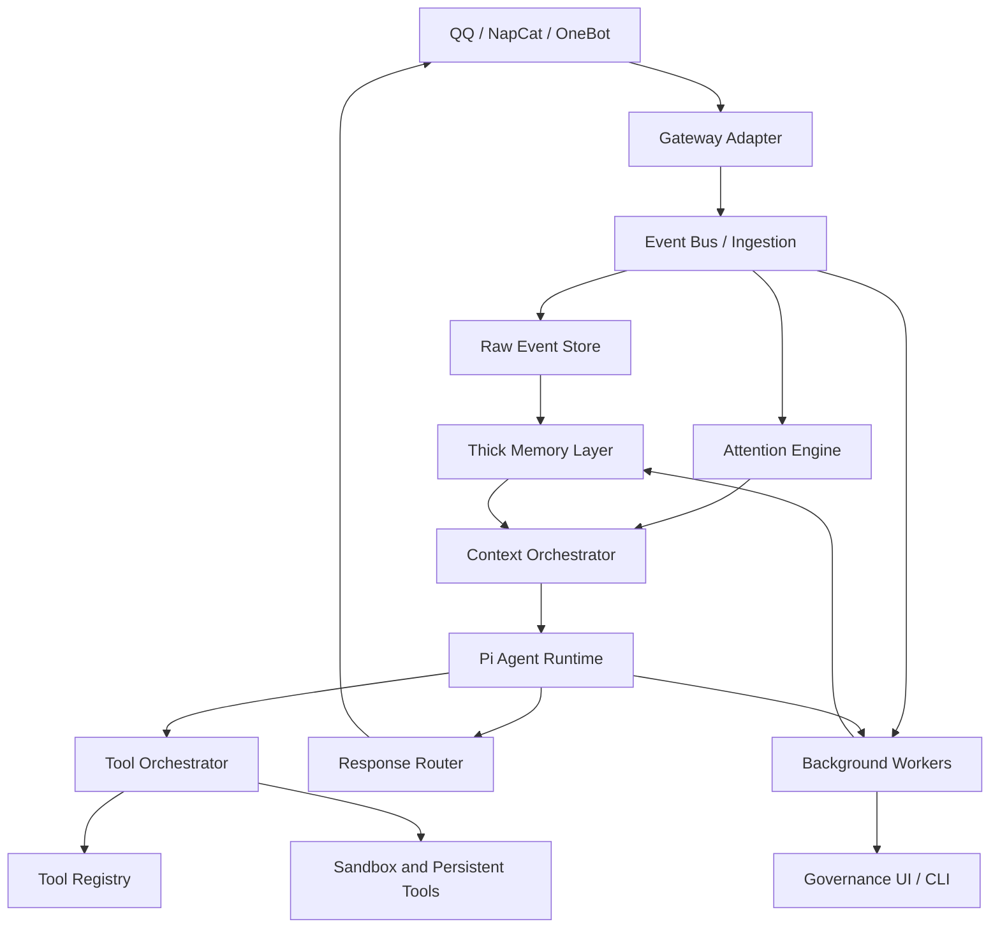

# Architecture

LetheBot uses layered boundaries so the bot can evolve without turning into one large chat handler.

## Layers

### Gateway Adapter

Owns protocol details only:

- NapCat / OneBot connection.
- Message send and receive.
- Platform event parsing.
- Media and quote normalization.
- Retry and reconnect behavior.

It must not perform memory retrieval or agent prompting directly.

### Ingestion

Turns platform events into internal events:

- `ChatMessageReceived`
- `MessageMentionedBot`
- `PrivateMessageReceived`
- `GroupMemberUpdated`
- `ToolEventRecorded`
- `AgentTurnCompleted`

It writes raw events before downstream processing.

### Attention Engine

Decides whether a message needs action:

- Ignore.
- Store only.
- Summarize later.
- Reply now.
- Ask Pi with recent context.
- Ask Pi with thick memory retrieval.

### Thick Memory Layer

Owns long-term memory, retrieval, lifecycle, and governance. It is independent from Pi and from QQ.

### Context Orchestrator

Builds the actual agent input:

- Selects prompt layers.
- Retrieves user and group memory.
- Applies token budgets.
- Injects recent chat context.
- Records which memories were used.

### Pi Agent Runtime

Owns reasoning, tool calling, model streaming, and turn state. Preferred integration is the Pi SDK with custom tools and context transformation.

### Tool Layer

Owns tools available to the agent:

- Memory search and memory proposal tools.
- QQ interaction tools.
- Filesystem or sandbox tools.
- Long-running task tools.

### Background Workers

Run asynchronous maintenance:

- Summarization.
- Fact extraction.
- Importance scoring.
- Reflection.
- Memory decay.
- Embedding updates.
- Conflict detection.

