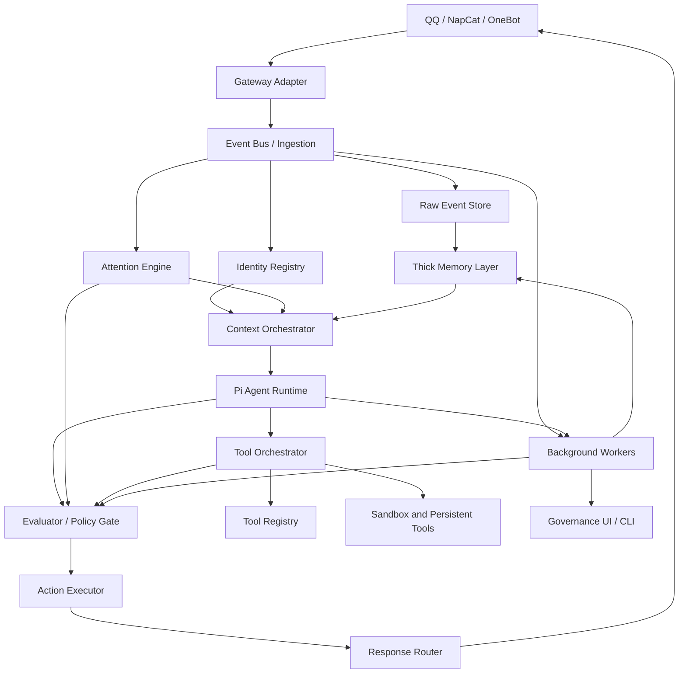

# Architecture

LetheBot uses layered boundaries so the bot can evolve without turning into one large chat handler.

Important P0 implementation rule: these boxes are logical ownership boundaries, not mandatory deployment boundaries. The MVP should prefer a lightweight single service or small modular monolith, with interfaces/data schemas preserving the boundaries. Do not turn this diagram into microservices prematurely.

## Execution Profiles

The architecture should not run every layer synchronously for every message. P0 uses separate execution profiles:

- `silent_fast_path`: receive, normalize, append raw event, attention says no outward action, optionally enqueue background summary.
- `reply_fast_path`: receive, append raw event, attention, minimal ContextPack, Pi response, deterministic checks, send.
- `risk_path`: proactive group reply, proactive DM, cross-scope memory, auto-active memory, dangerous tool, or platform admin action goes through evaluator/policy and executor.
- `tool_path`: Pi proposes a tool call, registry/policy/sandbox/audit run it, then result returns to Pi or async notification.
- `background_path`: summary, extraction, embeddings, decay, and conflict detection run outside the chat response path.
- `admin_governance_path`: inspection, deletion, disable, rollback, and `/why` traces run outside ordinary conversation flow.

Evaluator calls are risk-triggered, not mandatory for every ordinary reply.

## Layers

### Gateway Adapter

Owns protocol details only:

- NapCat / OneBot connection.
- Message send and receive.
- Platform event parsing.
- Media and quote normalization.
- Retry and reconnect behavior.

It must not perform memory retrieval or agent prompting directly.

It should expose runtime capability information for platform-specific features such as true emoji reaction, face-message fallback, group/private folded forward messages, and custom forward nodes. Reasoning layers output actions; the gateway adapter reports what can actually be delivered.

### Ingestion

Turns platform events into internal events:

- `ChatMessageReceived`
- `MessageMentionedBot`
- `PrivateMessageReceived`
- `GroupMemberUpdated`
- `ToolEventRecorded`
- `AgentTurnCompleted`

It writes raw events before downstream processing.

### Attention Engine

Produces action candidates instead of a single yes/no reply decision:

- store only;
- summarize later;
- reply short/full;
- reply with tool;
- propose memory;
- admin digest;
- proactive DM;
- scheduled background work;
- reaction or folded-forward response when the gateway supports it.

The Attention Engine uses trigger scores and suppressors. Strong triggers such as `@bot`, reply-to-bot, command prefix, or owner/admin instruction increase priority, but no group trigger forces a reply. Suppressors can downgrade outward actions to silent storage, admin digest, or DM.

See `social-action-model.md`.

### Thick Memory Layer

Owns long-term memory, retrieval, lifecycle, revisions, source links, visibility/sensitivity policy, and governance. It is independent from Pi and from QQ.

Pi and evaluators may propose memory changes, but durable writes go through memory policy and the action executor. Auto-active memory must have source metadata, evaluator decision linkage, and rollback/supersede support.

### Context Orchestrator

Builds the actual agent input:

- Selects prompt layers.
- Retrieves user and group memory.
- Applies token budgets.
- Injects recent chat context.
- Injects minimal participant identity/display context.
- Applies visibility/sensitivity filters.
- Records which memories and identity fields were used.

It owns prompt minimization. Identity registry and display profile data are injected only when useful for the current turn, not as full account tables.

### Pi Agent Runtime

Owns reasoning, tool calling proposals, model streaming, and turn state. Preferred integration is the Pi SDK with custom tools and context transformation.

Pi does not directly own durable memory, platform delivery, policy enforcement, or dangerous execution. It emits tool calls and candidate actions that pass through LetheBot's tool registry, evaluator/policy gate, action executor, and audit layers.

### Evaluator / Policy Gate

Owns structured review of risky decisions:

- proactive group replies and DM;
- cross-scope memory use;
- automatic memory activation;
- dangerous tool calls;
- admin digests;
- redaction decisions.

The evaluator can be LLM-backed, but final enforcement is deterministic policy plus executor checks. `evaluator: bypass` means bypassing LLM review only; it does not bypass L0 hard policy, permissions, sandboxing, or audit.

### Action Executor

Executes approved social, memory, tool, background, and platform actions. It records audit entries, applies cooldown/budget downgrades, respects gateway capabilities, and creates rollback handles where needed.

### Tool Layer

Owns tools available to the agent:

- Memory search and memory proposal tools.
- QQ interaction tools.
- Filesystem or sandbox tools.
- Long-running task tools.

Tools are registered through metadata described in `tool-registry.md`: capabilities, permissions, evaluator policy, audit level, sandbox policy, and output sensitivity. Tool availability is separate from evaluator review policy.

### Background Workers

Run asynchronous maintenance:

- Summarization.
- Fact extraction.
- Importance scoring.
- Reflection.
- Memory decay.
- Embedding updates.
- Conflict detection.

