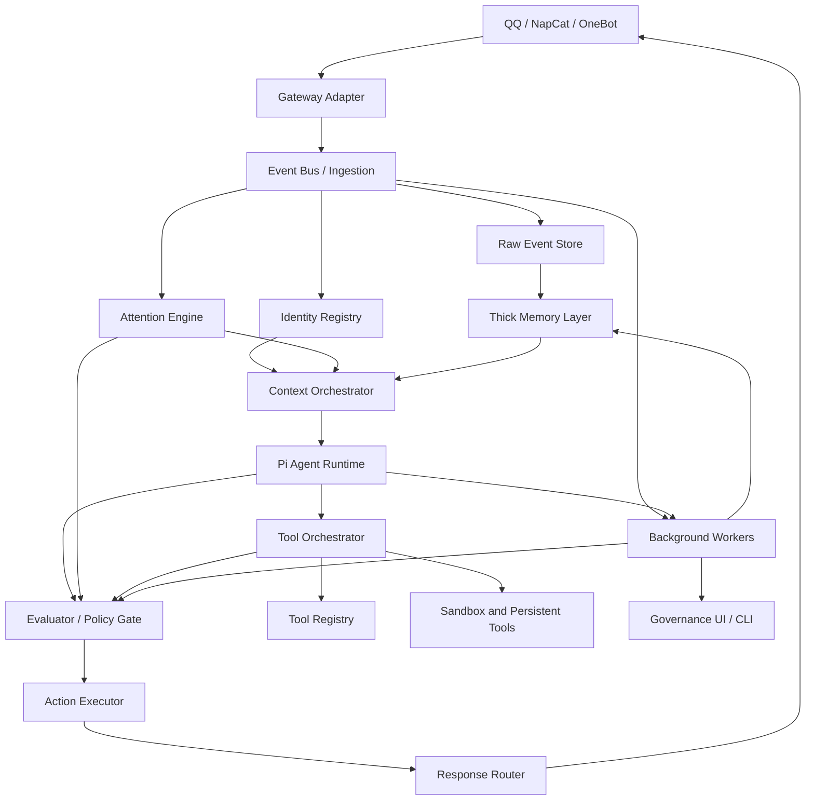

# Architecture

LetheBot uses layered boundaries so the bot can evolve without turning into one large chat handler.

Important P0 implementation rule: these boxes are logical ownership boundaries, not mandatory deployment boundaries. The MVP should prefer a lightweight single service or small modular monolith, with interfaces/data schemas preserving the boundaries. Do not turn this diagram into microservices prematurely.

## Execution Profiles

The architecture should not run every layer synchronously for every message. P0 uses separate execution profiles:

- `silent_fast_path`: receive, normalize, append raw/chat evidence, admit any
  high-precision reference-only extraction intent, and let Attention return with
  no outward action.
- `delayed_attention_path`: an unmentioned group question persists its chat row,
  source-bound candidate, and scheduled `attention_recheck` job without invoking
  Pi or sending; the durable worker decides later whether to suppress or re-enter
  the reply pipeline.
- `reply_fast_path`: receive, append raw event, attention, minimal ContextPack, Pi response, deterministic checks, send.
- `risk_path`: proactive group reply, proactive DM, agent-originated
  cross-scope/auto-active memory, dangerous tool, or platform admin action goes
  through evaluator/policy and the relevant executor boundary.
- `tool_path`: Pi proposes a tool call, registry/policy/sandbox/audit run it, then result returns to Pi or async notification.
- `background_path`: the currently registered durable summary, extraction,
  delayed-Attention recheck, consolidation, decay, conflict, admin-digest, and
  retention jobs run outside the chat response path.
  Embedding/reflection/importance-scoring pipelines are future extension points,
  not current worker registrations.
- `admin_governance_path`: inspection, deletion, disable, rollback, and `/why` traces run outside ordinary conversation flow.

For any deterministic extraction candidate, initial derived persistence commits
the inbound chat row and reference-only extraction job in one SQLite transaction
before Attention can return or Pi/send can fail. A delivered automatic reply
later commits the bot chat row and terminal turn state together. Extraction
itself runs through the durable worker and is not part of Pi inference or gateway
delivery latency.

Evaluator calls are risk-triggered, not mandatory for every ordinary reply.

## Layers

### Gateway Adapter

Owns protocol details only:

- NapCat / OneBot connection.
- Message send and receive.
- Platform event parsing.
- Media and quote normalization.
- Retry and reconnect behavior.

It must not perform memory retrieval or agent prompting directly.

It should expose runtime capability information for platform-specific features such as true emoji reaction, face-message fallback, group/private folded forward messages, and custom forward nodes. Reasoning layers output actions; the gateway adapter reports what can actually be delivered.

### Ingestion

The current gateway contract emits one discriminated inbound event,
`ChatMessageReceived` / `chat.message.received`. Private/group shape, mention,
quote, and sender-role distinctions are fields on that event. Tool and turn
events are durable repository/audit records rather than additional inbound
event discriminators.

It writes raw events before downstream processing. An accepted gateway claim
atomically stores the canonical raw event, ingress receipt, and one processing
admission. The handler transitions that admission from `accepted` to
`processing` before identity, chat, turn, Pi, tool, or send work begins.
Startup may replay schema-valid `accepted` admissions with no derived evidence.
It may also reset and replay a `processing` admission only after a fresh,
write-locked read proves the same strict stored event and accepted receipt plus
zero chat, trigger-turn, or failure evidence, and a guarded reset wins exactly
once. Processing work with any such evidence or a contradictory stored claim is
quarantined if it still remains `processing`; a reset that loses to another
state transition is not enqueued and leaves that newer state untouched. The
quarantine compare-and-set atomically marks linked `pending`/`running` turns
`aborted` with bounded recovery evidence;
already-terminal turns and downstream context/action/delivery evidence remain
unchanged. This is singleton startup recovery after the prior process stops, not
a multi-instance lease protocol.

### Attention Engine

Produces fast classification signals and a recommended execution path, not a
complete `ActionDecision`. The later social-decision service constructs and
persists concrete reply, silent, memory, background, or platform actions;
ActionExecutor verifies and executes the approved plan.

The Attention Engine uses trigger scores and suppressors. Strong triggers such as
`@bot`, reply-to-bot, command prefix, or owner/admin instruction increase
priority, but no group trigger forces a reply. The normalized group `senderRole`
is passed to attention analysis so an unmentioned owner/admin instruction
reaches the evaluator risk path; the identical member message remains on the
ordinary silent path.

An unmentioned QQ group question is instead classified as `defer` with
`recommendedPath='delayed_recheck'`. After the accepted raw claim exists, the
derived chat row, normalized `attention_candidates` row, and pending
`attention_recheck` job commit atomically. Candidate `observed_at` is the local
ingress receipt time stored in `raw_events.created_at` and matched by the
admission/accepted receipt; it is not the platform-supplied message clock. The
job becomes eligible at `observed_at + 15s`, and the candidate expires at
`observed_at + 120s`.

The recheck first reconstructs and revalidates the strict stored event, deriving
reply-path signals with the `delayed_recheck` trigger. It then takes an immediate
SQLite write lock and requires the current unexpired job-attempt lease before
creating the candidate's single terminal decision.
Suppressor priority is: expired thread; a later explicit human reply to the
source message; at least six human QQ messages in the exact group during the
preceding 10 seconds; or two prior `respond` reservations for that group during
the preceding 10 minutes. A `respond` decision reserves that group budget in the
same transaction, after which the worker re-enters turn processing with the
derived signals and without inserting the raw/chat source again. Because the
source neither mentions nor replies to the bot, the resulting group intervention
remains proactive and requires social evaluation.

Job results contain bounded IDs, outcome, suppressor ID/code pairs, and, for a
response, terminal turn/action IDs plus whether local delivery evidence exists;
they do not copy message text. A retry reuses the one Attention decision and a
locally terminal/delivered turn, and refuses an indeterminate prior turn. This
guards ordinary durable retries but cannot provide external exactly-once across
a QQ gateway send and a process failure before local delivery evidence commits.

See `social-action-model.md`.

### Thick Memory Layer

Owns long-term memory, retrieval, lifecycle, revisions, source links, visibility/sensitivity policy, and governance. It is independent from Pi and from QQ.

Pi and evaluators may propose memory changes, but durable writes go through
governed repository/proposal services. Approved action proposals are one writer
route; background summaries and other governed services may write through the
same repository boundary. Every active write must have usable source metadata,
a revision/audit policy identifier, and rollback/supersede support. The current
background summary path uses a local L0 policy identifier rather than a durable
`evaluator_decisions` row. Group summaries additionally require an enabled
exact-group policy generation. Discovery and action-originated enqueue use one
governed job service. It plans eligible chat sources in local raw-event ingress
order, requires the default ten pre-budget candidates, applies the ContextBuilder
budget, and freezes the exact ordered post-budget chat IDs in `jobs.payload`.
One valid pending/running window is reused before replanning; otherwise scope,
policy generation, and ordered sources derive the idempotency key. Job insertion
and the binding to group, conversation, eligibility epoch, and policy generation
commit atomically after the policy and sources are revalidated.
Completed and terminally failed frozen windows are skipped by later planning, so
exhausted work cannot be returned as newly scheduled or starve newer sources.

The handler rejects a missing or malformed frozen list before Provider access.
The worker then requires the exact source rows, canonical order, group and
conversation, policy epoch, and ContextBuilder selection to remain unchanged.
It checks the binding and current job-attempt lease before each Provider attempt,
then rereads the exact snapshot and rechecks policy, generation, and lease in the
same immediate transaction as the governed memory write. Disabling a policy
therefore blocks retrieval and new effects without deleting retained summaries;
a Provider invocation that was already in flight may remain as truthful evidence
while its job terminates with no memory effect.

Automatic extraction is separate: a pure deterministic detector admits the
reference-only job with the canonical inbound chat row, independently of reply
delivery. Private admission preserves the existing first-person patterns; group
auto-admission is limited to bounded exact name, attribute, like, and dislike
statements and excludes generic identity, reported, question, hypothetical,
want, and need forms. The durable job attempt owns the configured evaluator
request, and the decision plus governed memory/source/revision/audit effect
commit in one transaction. A retry may reuse that exact effect only when its
decision resolves to an attempt from the same extraction job and canonical
raw/chat source. New evaluator effects require the exact current attempt number
and worker/lease owner with an unexpired lease; authority is checked before and
after the synchronous effect so expiry rolls the whole transaction back. Later
lifecycle mutations record their own explicit evaluator or local L0 policy
identity rather than inheriting extraction's create decision; retry validates
immutable revision-1/create-audit evidence instead of the mutable current-record
identity.

The configured model evaluator is also source-bound before it calls the
Provider. Schema v3 records one turn- or job-attempt-owned invocation and its
terminal status, token counts, and response digest without prompt/response
content. Successful tool, social, and extraction decisions carry a nullable
unique foreign-key link to that completed invocation; writer-side validation
requires exact request/domain/owner/source/model/timestamp agreement. Stub and
local-policy decisions remain unlinked and cannot satisfy Provider-backed
acceptance evidence.

### Context Orchestrator

Builds the actual agent input:

- Selects prompt layers.
- Retrieves user and group memory.
- Applies token budgets.
- Injects recent chat context.
- Injects minimal participant identity/display context.
- Applies visibility/sensitivity filters.
- Records which memories and identity fields were used.

It owns prompt minimization. Identity registry and display profile data are injected only when useful for the current turn, not as full account tables.

For group turns, retained `scope='group' AND kind='summary'` memory is eligible
only when the exact current group has an enabled summary policy. That predicate
is part of the retrieval/search SQL before bounded limits. Missing policy,
missing exact group context, or a legacy database without the policy table fails
closed. ContextTrace may retain a bounded set of blocked summary IDs and the
`group_summary_policy_disabled` reason for explainability, but trace IDs are not
the enforcement mechanism.

### Pi Agent Runtime

Owns reasoning, tool calling proposals, model streaming, and turn state. Preferred integration is the Pi SDK with custom tools and context transformation.

The current adapter reuses one stateful SDK Agent behind a FIFO turn lease shared
by streamed and non-streamed entry points. It resets retained Agent state before
each turn and holds the lease through prompt/idle settlement and result or stream
cleanup, so Context Orchestrator output remains the sole source of conversation
history and mutable event/tool/actor attribution belongs to one turn at a time.

Pi does not directly own durable memory, platform delivery, policy enforcement,
or dangerous execution. PiAdapter routes tool calls through the tool registry,
evaluator/policy gate, effect coordinator, and audit boundary; candidate social
actions are constructed later and pass through ActionExecutor.
At the handler boundary, the adapter also composes Pi cancellation with the
registered cooperative runtime limit. It awaits actual handler settlement and
blocks expired results from success/effect commit; hard termination still
belongs to a subprocess, worker, or container execution backend.

### Evaluator / Policy Gate

Owns structured review of risky decisions:

- proactive group replies and DM;
- cross-scope memory use;
- automatic memory activation;
- dangerous tool calls;
- admin digests;
- redaction decisions.

The evaluator can be LLM-backed, but final enforcement is deterministic policy
plus executor checks. `evaluatorPolicy: 'bypass'` means bypassing LLM review
only; it does not bypass L0 hard policy, permissions, sandboxing, or audit.

### Action Executor

Executes approved social, memory, background, and platform actions. At entry it
clones and synchronously verifies the exact unredacted decision against the
process-keyed durable binding, redacted inspection row, exact linked evaluator
outcome/authority metadata, bound turn source, and the turn's current decision
pointer before any awaited effect; persisted redacted actions are never used as
executable input. Creation snapshots the complete input before it independently
reconstructs the evaluator-authorized final action, while allowing only
deterministic all-`silent_store` cooldown suppression to differ. Tool calls are
orchestrated by `PiAdapter` after registry/policy/evaluator checks and are not
executed by this action executor. The current action result contract has no
general rollback-handle API; failure evidence and repository transactions are
the implemented recovery boundary.

### Tool Layer

Owns the registry and metadata for tools available to the agent. The current
production registry contains `memory.search`, `memory.propose`,
`memory.disable`, and `group.recent_summary`. File/network handlers and QQ or
long-running task categories exist as isolated/dormant extension points, but
are not runtime-registered by the main application. Tools are registered
through metadata described in `tool-registry.md`: capabilities, permissions,
evaluator policy, audit level, sandbox policy, and output sensitivity. Tool
availability is separate from evaluator review policy.

### Background Workers

Run asynchronous maintenance. The current durable task union and production
handler map are `summary`, `extraction`, `attention_recheck`, `consolidation`,
`decay`, `conflict`, `admin_digest`, and `retention`. Importance scoring,
reflection, and embedding updates remain future design extensions; `reflection`
is currently a memory kind, not a registered worker. Completion, failure, and
lease renewal are fenced to the current running attempt and its unexpired lease.
A worker that loses that authority cannot report a durable completion; the
expired job remains available for normal reclaim and retry handling.

Retention pins the raw/chat source of an Attention candidate while its job is
`pending` or `running`. Once the job is terminal, ordinary retention may delete
the source; source foreign-key cascades then remove the candidate and its
decision/suppressors while leaving the durable job and attempt history intact.
It also parses frozen group-summary payloads defensively and pins their exact
chat/raw sources while the job is `pending` or `running`. Completed and failed
payload-only jobs release that pin; a completed summary's FK-backed
`memory_sources` independently retains its final provenance.
