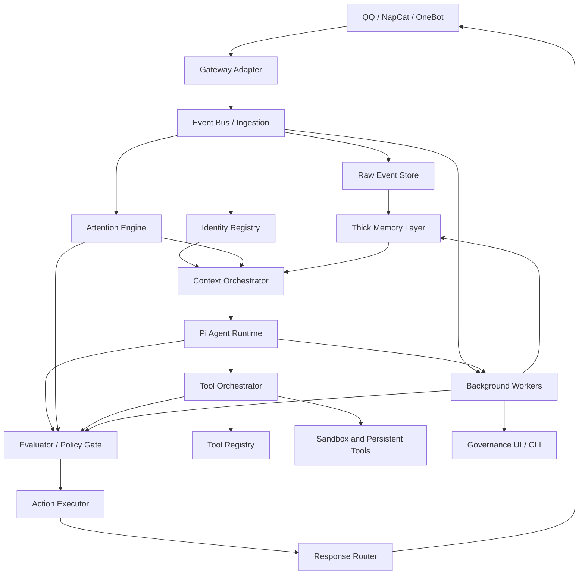

# Architecture

LetheBot uses layered boundaries so the bot can evolve without turning into one large chat handler.

Important P0 implementation rule: these boxes are logical ownership boundaries, not mandatory deployment boundaries. The MVP should prefer a lightweight single service or small modular monolith, with interfaces/data schemas preserving the boundaries. Do not turn this diagram into microservices prematurely.

```mermaid
flowchart TD
  A[QQ / NapCat / OneBot] --> B[Gateway Adapter]
  B --> C[Event Bus / Ingestion]
  C --> D[Raw Event Store]
  C --> E[Attention Engine]
  C --> O[Identity Registry]

  D --> F[Thick Memory Layer]
  O --> G[Context Orchestrator]
  E --> G
  F --> G

  G --> H[Pi Agent Runtime]
  H --> P[Evaluator / Policy Gate]
  E --> P
  P --> Q[Action Executor]

  H --> I[Tool Orchestrator]
  I --> J[Tool Registry]
  I --> K[Sandbox and Persistent Tools]
  I --> P

  Q --> L[Response Router]
  L --> A

  C --> M[Background Workers]
  H --> M
  M --> F
  M --> P
  M --> N[Governance UI / CLI]
```

## Execution Profiles

The architecture should not run every layer synchronously for every message. P0 uses separate execution profiles:

- `silent_fast_path`: receive, normalize, append raw/chat evidence, admit any
  high-precision reference-only extraction intent, and let Attention return with
  no outward action.
- `delayed_attention_path`: an unmentioned group question persists its chat row,
  source-bound candidate, and scheduled `attention_recheck` job without invoking
  Pi or sending; the durable worker decides later whether to suppress or re-enter
  the reply pipeline.
- `reply_fast_path`: receive, append raw event, attention, minimal ContextPack, Pi response, deterministic checks, send.
- `risk_path`: proactive group reply, proactive DM, agent-originated
  cross-scope/auto-active memory, dangerous tool, or platform admin action goes
  through evaluator/policy and the relevant executor boundary.
- `tool_path`: Pi proposes a tool call, registry/policy/sandbox/audit run it, then result returns to Pi or async notification.
- `background_path`: the currently registered durable summary, extraction,
  delayed-Attention recheck, consolidation, decay, conflict, admin-digest, and
  retention jobs run outside the chat response path.
  Embedding/reflection/importance-scoring pipelines are future extension points,
  not current worker registrations.
- `admin_governance_path`: inspection, deletion, disable, rollback, and `/why` traces run outside ordinary conversation flow.

For any deterministic extraction candidate, initial derived persistence commits
the inbound chat row and reference-only extraction job in one SQLite transaction
before Attention can return or Pi/send can fail. A delivered automatic reply
later commits the bot chat row and terminal turn state together. Extraction
itself runs through the durable worker and is not part of Pi inference or gateway
delivery latency.

Evaluator calls are risk-triggered, not mandatory for every ordinary reply.

## Layers

### Application HTTP Server

`src/http/application-http-server.ts` owns the Node HTTP listener, configured
path and method dispatch, metrics format query selection, endpoint coordinate
logs, `404` response, and callback-based listen/close settlement. It receives
immutable host, port, path, and reverse-HTTP exposure configuration plus narrow
health, readiness, metrics, and OneBot callbacks.

`LetheBotApp` remains responsible for constructing health/readiness payloads,
collecting and serializing operations metrics, and handling OneBot
authentication, body bounds, parsing, live admission, and domain work.
Application startup invokes admission recovery before starting the gateway and
starts the HTTP listener afterward; shutdown still closes ingress and the
listener while draining accepted work before stopping the gateway and database.
There is one production application listener and no compatibility listener.

### Governance HTTP Server

`src/http/governance-http-server.ts` owns a separate optional Node HTTP
listener and the local-admin session, CSRF, request-bound, fixed-failure, and
opaque-scope-handle boundary defined in
[`docs/governance-ui.md`](./governance-ui.md). Its configuration is default-off
and accepts only exact loopback hosts. It does not use QQ or forwarded identity
headers as HTTP authority.

`LetheBotApp` constructs this server with the explicitly registered bounded
domain routes, starts it before the application listener, and closes both
listeners when either startup fails or normal shutdown begins. The wired
boundary exposes the session lifecycle plus the authenticated, payload-free
Activity model-invocation aggregate and bounded default tool-call, action-
decision, action-execution, job, job-attempt, worker-heartbeat, event-processing-
failure, and audit lists, plus purpose-specific Privacy user-scope discovery.
It also exposes purpose-specific exact-group summary-policy scope discovery.
Those handles are bound only to
`governance.group_summary_policy.status.read` and authorize only the fixed
identifier-free effective-policy status at exact-scope read-only
`GET /governance/api/v1/group-summary/policy`. Mutation-marked `POST` at that
same path accepts only one fixed target-state change request, returns the
existing write-free projection, and issues current-session
`group.summary_policy.change` authority bound to the exact group scope, current
state/generation evidence, and digest. Separate mutation-marked
`POST /governance/api/v1/group-summary/policy/confirm` consumes that matching
authority once, recomputes the exact snapshot, and invokes only the shared
atomic expected-snapshot mutation. Success returns fixed state, generation,
eligibility, enforcement, audit, cancellation, and rollback evidence. It also
exposes authenticated display-profile scope discovery at
`GET /governance/api/v1/display-profile/scopes`. The shared unscoped boundary
rejects queries and scope headers, while each exact-user handle is bound to the
current session, expiry, and `governance.display_profile.targets.read`. Exact-
scope read-only `GET /governance/api/v1/display-profile/targets` requires one
such handle and passes only its resolved user scope to the shared bounded target
resource-handle query. Each returned target handle is independently bound to
that current session and expiry, the same read purpose, resource kind
`display_profile_target`, the full internal target ID, and the exact user scope.
Read-only
`GET /governance/api/v1/display-profile/targets/<resource-handle>` requires that
same scope authority, resolves the resource against the current session,
purpose, kind, and exact scope, and delegates only to the bounded shared target-
detail projection. Missing detail is concealed as `404`. Mutation-marked `POST`
at that same resource path accepts only `{ "action": "redact" }` after the
shared Origin/CSRF and exact-authority checks, delegates only to the write-free
full-row preview, and binds its snapshot fingerprint, total affected rows, and
preview digest into fresh current-session `display_profile.redact` authority.
Separate mutation-marked `POST` at the same resource path plus `/confirm`
accepts only `{ "confirm": true, "previewHandle": HANDLE }`, consumes matching
authority once, recomputes the exact preview, resolves the trusted internal
mutation selectors, and invokes only the shared atomic expected-snapshot
redaction. Unknown authority is concealed as `404`; reused, drifted, or stale
authority conflicts. Success returns only identifier-free affected counts,
redaction time, effects, audit evidence, and the irreversible rollback boundary.
Mutation-marked authenticated-unscoped
`POST /governance/api/v1/identity/platform-accounts/unlink` accepts only the
exact unlink action plus normalized `qq` account selector after the shared
Origin/CSRF, body, query, and scope-header boundary. It invokes only the shared
write-free active-mapping preview. A match returns that identifier-free
projection plus a session-owned opaque resource handle whose private binding
retains the structured selector and a separate short-lived action handle bound
to the same system scope/resource, snapshot fingerprint, fixed one-row version,
and preview digest. Missing or inactive mappings are concealed as `404`.
A separate mutation-marked
`POST /governance/api/v1/identity/platform-accounts/unlink/confirm` accepts only
exact `{ "confirm": true, "resourceHandle": HANDLE, "previewHandle": HANDLE }`.
It resolves the current-session system-scoped resource and strictly parses its
private canonical selector before consuming matching action authority once,
recomputes the exact preview fingerprint, fixed one-row version, and digest,
then invokes only the shared atomic expected-snapshot unlink with the fixed HTTP
reason. Unknown authority is concealed as `404`; replay, drift, and service-side
staleness conflict. Success returns only identifier-free account/disable/effect,
redacted-audit, and unsupported-relink evidence.
It also
exposes purpose-specific record-
backed Memory scope discovery;
those handles authorize only the bounded identifier-free Memory-record page for
their exact scopes. Each page entry adds a `memory_record` resource handle bound to
that current session, expiry, read purpose, and exact scope. That authority can
read only the fixed bounded record/source/revision/audit provenance detail under
the same exact scope. An issued Privacy handle authorizes only the bounded
owner-identifier-free preference page for its exact user scope. A mutation-
marked POST at the same Privacy path accepts only one fixed preference-change
request, returns the unchanged write-free state/effect/rollback projection, and
binds its preference type, exact scope, current effective state/version, and
digest to a fresh current-session `privacy_preference` preview handle. A
separate CSRF-protected
`POST /governance/api/v1/privacy/preferences/confirm` accepts only exact
`{ "confirm": true, "previewHandle": HANDLE, "preferenceType": TYPE,
"targetState": STATE }`, consumes matching current-session Privacy authority once,
recomputes the B22B digest-bound snapshot, and invokes only the shared atomic
expected-snapshot service operation. Unknown authority is concealed, while
reused, drifted, or stale authority conflicts. Success returns fixed preference,
audit, enforcement, and rollback evidence without raw identifiers or reasons.
No new schema, dependency, registry, or repository path is introduced. A
CSRF-protected preview-only POST
over that Memory resource authority accepts only the fixed
forget or restore action. Each action returns its identifier-free projection
and binds its current state, revision, and digest to a fresh current-session,
action-specific preview handle. The matching `/confirm` POST preserves the
exact two-key forget confirmation and accepts restore only with an additional
fixed restore action. It consumes only the matching authority once, recomputes
the corresponding exact preview, and invokes the shared atomic expected-
snapshot forget or restore operation. It returns only fixed lifecycle,
revision, audit, retrieval, and rollback evidence; stale or reused authority
conflicts.
Trace-backed Explain discovery returns only fixed labels,
fingerprints, and exact-conversation handles bound to the current session,
expiry, and Explain-read purpose. That authority reads only the fixed bounded
identifier-free turn page for its exact conversation. Each turn entry adds an
opaque `explain_turn` resource handle bound to that current session, expiry,
read purpose, and exact scope. That authority can read only the fixed bounded
identifier-free context/decision/execution/tool detail under the same exact
conversation scope. ContextBuilder rebuild and Explain mutation routes remain
absent. Tool input/output, decision action
plans, execution audit entries, job payloads/results, attempt results, worker
details, failure details, and Activity audit details remain absent; displayed
operational identifiers and diagnostics use the shared redaction boundary. The
server still has no direct governance-service, repository, or SQL path. C1 adds
only sessionless exact GETs at `/governance`, `/governance/`,
`/governance/app.css`, and `/governance/app.js`. The dependency-free browser
shell calls the existing session and aggregate Overview APIs, retains CSRF only
in module memory, and renders fixed aggregate fields with DOM text nodes. C2
adds only browser navigation and fixed rendering over the existing
authenticated-unscoped model-invocation Activity aggregate. It sends no query,
scope header, body, CSRF value, or new authority and renders only predeclared
purpose, status, usage, and latency fields. C3 adds semantic Activity subview
navigation and a responsive read-only table over the existing bounded
authenticated-unscoped tool-call list. It strictly accepts at most 100 fixed
B14D records, renders tool/requester, actor/context, outcome/diagnostic/
redaction, duration, and recorded time through safe DOM creation, and leaves
call, turn, canonical-user, input, and output fields out of the page. C4 reuses
that semantic tab and responsive-list pattern for the existing bounded
authenticated-unscoped worker-heartbeat list. It strictly accepts at most 100
fixed B14B records, renders only worker/type, fixed status, optional current
job, and heartbeat time through safe DOM creation, and rejects details or any
other response field. C5B adds Jobs as the fourth tab over the existing bounded
authenticated-unscoped B14C list. It accepts only the exact payload-free record
shape and at most 100 rows before rendering job/type/status, attempt progress,
schedule/update times, and optional lease/run/error evidence through text nodes.
Unknown keys, malformed fields, payload, and result fail closed. C5C consolidates
only the repeated Tool calls, Worker heartbeats, and Jobs list lifecycle behind
one fixed controller with explicit per-view DOM, endpoint, renderer, message,
and request-sequence configuration. Overview and Model invocations remain
separate, and per-view validation, stale cancellation, session expiry, tab
behavior, and safe rendering are unchanged. C5E changes only the fixed
JavaScript representation: one explicit key/ID binding table, accepted enum
domains with deterministic presentation, shared bounded text/date checks, and
shared record cell/status/list primitives replace repeated mechanics. Named
renderers, exact-key validators, DOM text/classes/order, requests, HTML, and CSS
remain unchanged, and the predecessor assets stay below 57,500 bytes. C5D adds
Job attempts as the fifth tab over the existing bounded authenticated-unscoped
B14G list. It accepts at most 100 exact result-free records, validates but does
not render the separate attempt ID, and renders only job/attempt, worker, fixed
status, optional error, and start/heartbeat/completion times through the shared
safe primitives. Unknown keys, malformed fields, result, and oversized arrays
fail closed before row replacement. It reuses the fixed controller and existing
responsive styles and sends only the exact default GET. The less-than-61,500-
byte result remains C5D's completed feature threshold. C6A adds Action decisions
as the sixth tab over the existing bounded authenticated-unscoped B14E list. It
accepts at most 100 exact actions-free records, validates but omits `turnId`, and
renders only the redacted decision reference, actor/risk, confidence, evaluator
state, action count, bounded reasons/suppressors, and decision time through the
shared safe primitives. Unknown keys, `actions`, malformed fields, unbounded
nested values, and oversized arrays fail closed before row replacement. It
reuses the controller and responsive styles without adding CSS, sends only the
exact default GET, and keeps the complete assets below the 65,536-byte permanent
boundary. C6B changes only the representation of the five non-model list
shells: one fixed local definition table constructs their tabs and panels with
`document.createElement`, fixed attributes, and `textContent` before controller
binding. The resulting runtime DOM, visible text, ordering, classes, ARIA and
hidden states, skeletons, controllers, validators, requests, session behavior,
keyboard/focus behavior, CSS, and responsive layout remain exact. The three
served assets are 8,641, 14,794, and 37,000 bytes, or 60,435 bytes total, below
the C6B 60,500-byte prerequisite and permanent boundary without parsing,
dynamic code, another asset, lazy loading, or a dependency. C6C adds Action
executions as the seventh tab over the existing bounded authenticated-unscoped
B14F list. It accepts at most 100 exact audit-entry-free records, validates the
fixed action/status/audit domains plus bounded references, diagnostics, and
canonical execution time, and renders only execution/decision references,
action/status, effect references, downgrade/error evidence, audit level, and
time through the shared safe primitives. Unknown keys, `auditEntry`, malformed
or nested fields, and oversized arrays fail closed before row replacement. It
uses only the exact default GET, existing controller and responsive table, plus
the existing semantic status colors. The three assets are 8,641, 14,850, and
39,809 bytes, or 63,300 total, below the permanent boundary without another
asset, backend authority, or dependency. C7A adds Event processing failures as
the eighth tab over the existing bounded authenticated-unscoped B14H list. It
accepts at most 100 exact details-free records, requires bounded failure/stage/
error fields, canonical occurrence time, and a lowercase 64-hex error hash,
and validates optional source/turn references, conversation type, and fixed
message/sender/conversation hashes. Unknown keys, `details`, malformed or
nested values, and oversized arrays fail closed before row replacement. Only
the redacted failure/time, optional references, stage/conversation type, error
name, and fixed hashes enter the shared safe text nodes. It uses the exact
default GET, existing controller and responsive table, and no new CSS. The
three assets are 8,641, 14,850, and 42,007 bytes, or 65,498 total, below the
permanent boundary without another asset, backend authority, or dependency.
C7B changes only the fixed JavaScript representation before the Audit view is
added. Identical tool/worker/job record and text bounds use three shared
constants, repeated record-line style strings use fixed shared constants, and
the asset compactor removes line terminators only after opening delimiters,
commas, or semicolons and before closing delimiters, commas, or semicolons.
HTML and CSS remain byte-identical; JavaScript tokens, accepted payloads,
requests, DOM, visible output, and runtime behavior remain unchanged. The three
assets are 8,641, 14,850, and 39,788 bytes, or 63,279 total, below the 63,300-
byte prerequisite and permanent boundary without token renaming, a parser,
another asset, backend authority, or dependency.
C7C adds Audit as the ninth tab over the existing bounded authenticated-unscoped
B14I list. It accepts at most 100 exact details-free records, requires bounded
event/category/level/summary fields, canonical time, exact actor keys and
booleans, and bounded optional actor/risk/evaluator evidence. Unknown keys,
`details`, malformed or nested values, and oversized arrays fail closed before
row replacement. Only the already-redacted event/time, category/level, actor,
summary/risk/evaluator, and explicit hidden/redacted signals enter shared safe
text nodes. It uses the exact default GET, existing controller and responsive
table, and no new CSS. The assets are 8,641, 14,850, and 41,778 bytes, or 65,269
total, below the permanent boundary without another asset, backend authority,
or dependency.
C8A changes only JavaScript ownership. The fixed `app.js` shell statically
imports one same-origin `activity.js` module. The module owns the shared
Activity path prefix, exact endpoint definitions, schemas, normalizers, and
safe renderers; the shell retains authentication, request transport, Overview,
navigation, controller state, stale cancellation, session transitions, and
listeners. HTML/CSS and every runtime DOM structure remain byte-identical. The
HTML, CSS, shell JavaScript, and Activity module are 8,641, 14,850, 18,380, and
23,616 bytes: the fixed shell is 41,871 bytes and all four assets total 65,487,
still below the permanent 65,536-byte aggregate boundary. Static dispatch
creates no session or domain effect; scoped
views and browser mutations remain later slices.

C8B adds the first scoped browser destination as a separate same-origin
`memory.js` module. The module constructs the semantic Memory navigation/view,
owns exact scope-catalog and record-page schemas, and renders only bounded
redacted record fields through DOM nodes and `textContent`. The shell retains
request transport, view/session state, stale cancellation, announcements, and
focus. Entering or refreshing Memory reads only `/memory/scopes`; no record read
occurs until the operator explicitly selects one option. The subsequent exact
`/memory/records` GET carries only that option's opaque handle in
`X-LetheBot-Scope`. Handles remain in module memory and never enter DOM text,
attributes, storage, or logs. Resource handles are validated but no detail or
mutation control is present.

Final HTML/CSS/shell-JavaScript/Activity-module/Memory-module sizes are
8,641/16,415/20,939/23,616/16,720 bytes. The fixed HTML/CSS/`app.js` shell is
45,995 bytes, and every individual asset remains below 65,536 bytes. With
independent feature modules, the permanent bound applies per asset plus the
stricter shell bound rather than summing separately cached feature modules.
No backend route, authority, dependency, or build step changes.

C8C adds Review as the secondary Memory tab while Records remains the default.
Review scope discovery uses only `/scopes`; review rows use only
`/memory-reviews` with the explicitly selected Review handle. Its catalog,
fingerprint selection, opaque handles, and request sequences are independent
from Records, so record-read authority is never reused for maintenance review.
The module validates the exact bounded proposal-list schema before replacing
rows and renders only proposal reference, kind/effect/lifecycle/scope,
candidate fingerprint/count, confidence, reason/revision evidence, dates, and
handle expiry. Handles stay internal. Review detail and every preview,
confirmation, and mutation remain absent. Final HTML/CSS/`app.js`/`activity.js`/
`memory.js` sizes are 8,641/16,918/24,328/23,616/31,215 bytes; the fixed shell
is 49,887 bytes and every asset remains below 65,536 bytes. No backend or
dependency boundary changes.

C8D makes the existing exact-scope Review detail GET reachable from each queue
row. `memory.js` keeps the selected proposal reference and current list-issued
resource handle in module memory, owns the independent detail request sequence,
and sends `GET /memory-reviews/:resourceHandle` with only the current Review
scope handle in `X-LetheBot-Scope`. `app.js` still owns and injects the existing
same-origin JSON transport, session-expiry transition, and announcement
functions. List refresh retains selection only by proposal reference, then uses
the newly issued resource handle; scope, subview, navigation, refresh, expiry,
and logout changes cancel or clear detail authority.

The module validates the complete bounded detail DTO and its candidate/revision
arrays before DOM replacement, then separately requires every list-level field
to agree with the selected current row. It renders only fixed proposal, effect,
candidate fingerprint/source-count, and revision transition/actor/reason/date
evidence. Scope and resource handles remain absent from DOM, storage, and logs.
No preview, confirmation, mutation, backend route, CSS, package, or dependency
is added. Final HTML/CSS/`app.js`/`activity.js`/`memory.js` sizes are
8,641/16,918/24,227/23,616/50,900 bytes; the fixed shell is 49,786 bytes and
every asset remains below 65,536 bytes.

C8E makes the existing exact-scope Memory Record detail GET reachable from each
Records row. The row command stores only a local index in the DOM, resolves that
index against the current normalized page, and sends
`GET /memory/records/:resourceHandle` with only the current Records scope handle
in `X-LetheBot-Scope`. Record detail owns a request sequence independent from
both list paths and Review detail. A refreshed list can retain only the record
reference before reloading through its newly issued resource handle; scope,
subview, navigation, refresh, expiry, and logout changes cancel or clear the
old authority.

The complete nested record must match the selected row except for list-only
handle fields. Sources, revisions, and audit entries are strictly bounded at 32
and validated for exact keys, fixed domains, references, safe counts/revision
numbers, redaction signals, canonical dates, ordering, uniqueness, truncation,
evaluator links, and hidden audit details before any DOM replacement. Only the
fixed redacted record and provenance evidence reaches safe text nodes. No
preview, confirmation, mutation, backend route, CSS, package, or dependency is
added. Final HTML/CSS/`app.js`/`activity.js`/`memory.js` sizes are
8,641/16,918/24,227/23,616/64,978 bytes; the fixed shell remains 49,786 bytes
and every asset remains below 65,536 bytes.

C8F changes only Memory JavaScript ownership. `memory.js` uses one static
same-origin import from `memory-presentation.js`. The presentation module owns
the fixed value domains and key tables, exact validators, normalizers,
list/detail coherence checks, safe DOM primitives, formatters, and Records and
Review renderers. The controller module retains all endpoints, complete view
construction, injected transport, scope/resource authority, selections,
request sequences, state transitions, cancellation, listeners, and the public
`createMemoryFeature` surface. Reassembling those two bodies after removing the
module boundary reproduces the exact C8E definition union. HTML, CSS, `app.js`,
and `activity.js` remain byte-identical; their sizes are
8,641/16,918/24,227/23,616 bytes, while `memory.js` and
`memory-presentation.js` are 32,442 and 33,072 bytes. Every asset remains below
65,536 bytes and both Memory modules remain below 35,000. No visible behavior,
request, authority, backend, CSS, package, dependency, or build step changes.

C8G adds one write-free approval-preview command only after a selected pending
Review row has produced coherent detail. The shell still owns the in-memory
CSRF token and injects a narrow transport that adds JSON content type, the
current Review scope handle, and CSRF to the browser-originated same-origin
`POST /memory-reviews/:resourceHandle`. `memory.js` owns the exact
`{ "action": "approve" }` body, current list-issued resource path, independent
request sequence, duplicate-request disablement, cancellation, expiry timer,
and unrequested/loading/populated/malformed/unavailable/not-found/stale states.

`memory-presentation.js` rejects unknown or malformed top-level and nested
keys, invalid domains, duplicate or reordered fixed effects, unsafe counts or
revisions, nonfuture expiry, and any selected scope/row/detail/preview drift.
Only the bounded action, proposal/effect and affected-record evidence, current
and expected revisions, fixed durable/unavailable effects, rollback boundary,
and expiry reach safe text nodes. At the C8G boundary the response preview
handle and digest are validated and immediately discarded; they never enter
the controller, DOM, storage, logs, or announcements. Selection, scope, refresh, subview,
navigation, expiry, session, and logout changes clear preview state and suppress
late responses. Confirmation, handle consumption, review transition, memory
application, rollback, and every durable write remain absent. Final HTML/CSS/
`app.js`/`activity.js`/`memory.js`/`memory-presentation.js` sizes are
8,641/16,918/24,428/23,616/39,220/38,754 bytes; the fixed shell is 49,987 bytes
and every asset remains below 65,536 bytes without CSS, backend, package,
dependency, or build changes.

C8H adds only the matching explicit approval confirmation over existing B7D.
After the same strict preview validation, `memory.js` keeps one private
transient authority containing the opaque preview handle, its expiry, and the
current Review selection binding; the digest is still discarded. `Confirm
approval` is enabled only while that binding remains current and unexpired.
The controller clears the authority before sending exact same-origin
`POST /memory-reviews/:resourceHandle/confirm` through the shell transport with
the current Review scope and exact
`{ "confirm": true, "previewHandle": HANDLE }` body.

`memory-presentation.js` accepts only the exact B7D approved result, including
the coherent proposal reference and next revision, approve revision/audit
references, false memory-record mutation, and unchanged rollback boundary.
Confirming, succeeded, malformed, unavailable, not-found, and conflict states
are independent from preview sequencing. Every failure consumes local authority
and requires a fresh preview; success clears selected row/detail/preview
authority, preserves only bounded result evidence, and refreshes Review. The
handle remains absent from DOM text and attributes, storage, logs,
announcements, presentation values, and exported feature state. Final HTML/CSS/
`app.js`/`activity.js`/`memory.js`/`memory-presentation.js` sizes are
8,641/16,918/24,428/23,616/46,670/41,758 bytes; the fixed shell remains 49,987
bytes and every asset remains below 65,536 bytes. Rejection, expiration,
application, rollback, memory-record mutation, backend, CSS, package,
dependency, and build behavior remain unchanged.

C8I adds only the matching write-free rejection preview over existing B8A.
`Preview rejection` is available only for coherent current pending Review
detail and sends exact `{ "action": "reject" }` through the same shell-owned
same-origin transport to the current list-issued
`POST /memory-reviews/:resourceHandle`, with the current Review scope and
in-memory CSRF. Starting it clears any approval confirmation authority while
preserving the selected detail; a later fresh approval preview can establish
new approval authority.

`memory-presentation.js` accepts only the exact rejected-state projection:
current `pending_review@N`, expected `rejected@(N+1)`, the fixed transition,
revision, and audit effects, unavailable memory-record mutation, and the
rejection-specific unsupported rollback boundary. It requires complete scope,
row, detail, and response coherence, then discards the validated rejection
handle and digest. `memory.js` owns an independent request sequence and expiry
timer plus unrequested, loading, populated, malformed, unavailable, not-found,
and stale states. Duplicate and late responses are suppressed; scope,
resource, selection, refresh, subview, navigation, expiry, session, and logout
changes clear rejection state and competing approval authority. Final HTML/CSS/
`app.js`/`activity.js`/`memory.js`/`memory-presentation.js` sizes are
8,641/16,918/24,428/23,616/53,035/46,484 bytes; the fixed shell remains 49,987
bytes and every asset remains below 65,536 bytes. No rejection confirmation,
review transition, memory application, rollback, memory-record mutation,
backend, CSS, package, dependency, or build behavior changes.

C8J adds the matching explicit browser rejection confirmation over existing B8B.
Only one coherent, unexpired populated C8I preview enables `Confirm rejection`.
The controller retains only a private transient rejection authority containing
the opaque preview handle, expiry, and current Review selection binding; it
discards the digest and never exposes the authority through presentation values,
DOM text or attributes, storage, logs, announcements, or exported feature state.

Confirmation clears that authority before sending the exact same-origin
`POST /memory-reviews/:resourceHandle/confirm` through the shell-owned transport
with the current Review scope, in-memory CSRF, and exact
`{ "confirm": true, "previewHandle": HANDLE, "action": "reject" }` body. The
exact B8B result must coherently report `rejected` at the preview-bound next
revision, fixed rejection transition/revision/audit evidence,
`memoryRecordMutation: false`, and the `rejection_does_not_apply_memory_effects`
boundary. Confirming, succeeded, malformed, unavailable, not-found, and conflict
states are independent; failures require a fresh preview, while success clears
selected Review authority and refreshes the queue. C8J adds no memory
application, rollback, backend route/DTO, persistence, CSS, package, dependency,
or build behavior.

C9A adds the write-free browser application preview over existing B9A for an
`approved` maintenance proposal. Consolidation and decay send exact
`{ "action": "apply" }`; conflict requires an explicit current-detail candidate
and sends exact `{ "action": "apply", "retainedMemoryRef": REF }`. The public
reference is resolved only by the backend; raw memory IDs never enter browser
state. Strict presentation accepts only a scope/proposal/revision-coherent B9A
projection, exact role counts and retrieval consequences, and the separate-
confirmation rollback boundary. The opaque preview handle and expiry remain
private transient controller authority; the digest is discarded. Selection,
Review scope/resource/detail drift, expiry, navigation, session change, and
logout invalidate the preview. C9A performs no application confirmation or
durable mutation and adds no backend, schema, dependency, or deployment change.

### Gateway Adapter

Owns protocol details only:

- NapCat / OneBot connection.
- Message send and receive.
- Platform event parsing.
- Media and quote normalization.
- Retry and reconnect behavior.

It must not perform memory retrieval or agent prompting directly.

It should expose runtime capability information for platform-specific features such as true emoji reaction, face-message fallback, group/private folded forward messages, and custom forward nodes. Reasoning layers output actions; the gateway adapter reports what can actually be delivered.

### Ingestion

The current gateway contract emits one discriminated inbound event,
`ChatMessageReceived` / `chat.message.received`. Private/group shape, mention,
quote, and sender-role distinctions are fields on that event. Tool and turn
events are durable repository/audit records rather than additional inbound
event discriminators.

It writes raw events before downstream processing. An accepted gateway claim
atomically stores the canonical raw event, ingress receipt, and one processing
admission. The handler transitions that admission from `accepted` to
`processing` before identity, chat, turn, Pi, tool, or send work begins.

`src/ingestion/event-ingress-claim.ts` owns the atomic raw-event insert and
scoped conflict lookup, per-delivery ingress receipt, initial accepted
processing admission, and bounded claim log. It receives the application
database explicitly and returns the canonical raw-event identity plus the local
accepted time only for a newly accepted event. A duplicate preserves the first
raw payload and admission while appending its receipt to that canonical event.
Any claim-stage write failure rolls the complete transaction back.

Startup may replay schema-valid `accepted` admissions with no derived evidence.
It may also reset and replay a `processing` admission only after a fresh,
write-locked read proves the same strict stored event and accepted receipt plus
zero chat, trigger-turn, or failure evidence, and a guarded reset wins exactly
once. Processing work with any such evidence or a contradictory stored claim is
quarantined if it still remains `processing`; a reset that loses to another
state transition is not enqueued and leaves that newer state untouched. The
quarantine compare-and-set atomically marks linked `pending`/`running` turns
`aborted` with bounded recovery evidence;
already-terminal turns and downstream context/action/delivery evidence remain
unchanged. This is singleton startup recovery after the prior process stops, not
a multi-instance lease protocol.

`src/ingestion/event-admission-recovery.ts` owns that startup enumeration,
strict stored-event validation, guarded processing reset, quarantine, linked
turn abort, and bounded aggregate log. It receives the application database and
`TurnRepository` explicitly and returns only validated accepted events.
`LetheBotApp` invokes it before gateway startup and passes the returned events to
the turn application service only from the gateway-ready callback. For live
ingress, `LetheBotApp` retains the accepting-ingress guard, invokes the claim
service, and passes only newly accepted claims onward.

### Turn Application Services

`src/application/turn-application-service.ts` owns accepted-event scheduling,
pending-task lifetime, absolute ingress-deadline derivation, conversation-key
selection, and the guarded `accepted` to `processing` to terminal admission
transitions. It also owns the redacted in-memory event-failure projection,
hashes-only durable handler-failure evidence, and atomic overload/queue-timeout
terminalization with its linked failure row. It receives the application
database, configured timeout, and the existing shared `TurnAdmissionController`
plus narrow event-handler, redaction, persistence-log, and task-failure
callbacks. It does not implement a second queue policy.

`src/application/conversation-turn-service.ts` owns the identity, chat,
governance, Attention, context, Pi, social-decision, action, response, and
memory-extraction-enqueue turn pipeline. It also owns the chat and bot-response
SQL, deadline-stage checks, turn completion selection, and caught failure
coordination. Replaceable Pi, action-executor, and social-decision runtimes are
resolved through injected callbacks so runtime test replacement remains
unchanged.

`src/application/background-runtime-service.ts` owns both durable worker lanes,
the scheduler catalog and lifecycle, summary discovery and execution, delayed
Attention replay and terminal-turn evidence lookup, maintenance routing,
retention, and task-payload validation. It resolves replaceable Pi and memory
extraction runtimes through narrow callbacks and re-enters the same conversation
handler used by live ingress.

`LetheBotApp` composes all three services and supplies their existing
repositories, runtimes, configuration, redaction, logging, and
failure-recording boundaries. Delayed work continues to schedule on the
controller shared with direct work, preserving one conversation FIFO. Health
diagnostics and shutdown read the turn application service's failure count,
drain its pending tasks, and drain the background scheduler before gateway and
database shutdown. There is one production live-admission path, one background
runtime, and no compatibility shim.

#### Composition root exit inventory

The final P7 ownership audit classifies every `LetheBotApp` field as follows:

| Category | Fields | Ownership conclusion |
|---|---|---|
| Constructed dependencies | `config`, `db`, `memoryRepo`, `identityRepo`, `auditRepo`, `turnRepo`, `admissionRecovery`, `eventIngressClaim`, `turnApplication`, `conversationTurn`, `toolCallRepo`, `privacyPreferenceRepo`, `jobRepo`, `groupSummaryPolicyRepo`, `governance`, `groupSummaryJobService`, `actionRepo`, `adapter`, `attention`, `delayedAttention`, `toolRegistry`, `policyGate`, `turnAdmission`, `piProvider`, `piModel`, `cooldowns`, `backgroundRuntime` | The root constructs and connects concrete configuration, storage, gateway, policy, application, and worker dependencies. |
| Replaceable runtime references | `pi`, `actionExecutor`, `socialEvaluator`, `socialDecisionService`, `memoryExtractor` | The root owns the current concrete runtime instances so the existing integration-test replacement seams resolve through the same production services. |
| Lifecycle state | `httpServer`, `governanceHttpServer`, `acceptingIngress`, `stopPromise` | The root owns both listener references, ingress availability, and idempotent process shutdown state. |

The constructor, `createMemoryExtractionWorker`, and `createTestPiRuntime` are
dependency-construction helpers. `start`, `stop`, `performStop`,
`closeHttpServer`, `closeGovernanceHttpServer`, and `waitForIdle` coordinate
process lifecycle.
`handleOneBotHttpEvent` and `claimAndEnqueueEvent` adapt the HTTP/gateway
boundaries to the single ingress claim and turn-application paths.
`buildHealthStatus`, `buildRuntimeStatusLocalState`, `buildReadinessStatus`,
`buildPublicAdapterStatus`, `redactErrorForLog`, and `redactSensitiveText`
project bounded diagnostics. `getEventProcessingFailures`,
`clearEventProcessingFailuresForTesting`, `getDatabase`,
`setPiRuntimeForTesting`, `setMessageSenderForTesting`,
`stopAdapterForTesting`, `startAdapterForTesting`,
`dispatchOneBotEventForTesting`, `enqueueBackgroundTaskForTesting`,
`processNextBackgroundJobForTesting`, `setSocialEvaluatorForTesting`, and
`clearCooldownsForTesting` are the existing narrow integration-test access
surface.

All root imports are top-level composition, boundary, diagnostics, or bootstrap
dependencies. Its only SQL calls are two `SELECT 1` database probes for health
and readiness; neither reads or mutates domain state. Application and governance
route/listener behavior remains in their dedicated HTTP modules while the root
coordinates their lifecycle; the retained OneBot body/auth callback is boundary
adaptation, not a second application HTTP server or ingress path. Module-level
fatal formatting, executable-main detection, signal handling, and process
startup remain bootstrap concerns. The root therefore contains no domain SQL,
turn pipeline, worker handler, scheduler implementation, or duplicate
production path, and P7 requires no further extraction.

### Attention Engine

Produces fast classification signals and a recommended execution path, not a
complete `ActionDecision`. The later social-decision service constructs and
persists concrete reply, silent, memory, background, or platform actions;
ActionExecutor verifies and executes the approved plan.

The Attention Engine uses trigger scores and suppressors. Strong triggers such as
`@bot`, reply-to-bot, command prefix, or owner/admin instruction increase
priority, but no group trigger forces a reply. The normalized group `senderRole`
is passed to attention analysis so an unmentioned owner/admin instruction
reaches the evaluator risk path; the identical member message remains on the
ordinary silent path.

An unmentioned QQ group question is instead classified as `defer` with
`recommendedPath='delayed_recheck'`. After the accepted raw claim exists, the
derived chat row, normalized `attention_candidates` row, and pending
`attention_recheck` job commit atomically. Candidate `observed_at` is the local
ingress receipt time stored in `raw_events.created_at` and matched by the
admission/accepted receipt; it is not the platform-supplied message clock. The
job becomes eligible at `observed_at + 15s`, and the candidate expires at
`observed_at + 120s`.

The recheck first reconstructs and revalidates the strict stored event, deriving
reply-path signals with the `delayed_recheck` trigger. It then takes an immediate
SQLite write lock and requires the current unexpired job-attempt lease before
creating the candidate's single terminal decision.
Suppressor priority is: expired thread; a later explicit human reply to the
source message; at least six human QQ messages in the exact group during the
preceding 10 seconds; or two prior `respond` reservations for that group during
the preceding 10 minutes. A `respond` decision reserves that group budget in the
same transaction, after which the worker re-enters turn processing with the
derived signals and without inserting the raw/chat source again. Because the
source neither mentions nor replies to the bot, the resulting group intervention
remains proactive and requires social evaluation.

Job results contain bounded IDs, outcome, suppressor ID/code pairs, and, for a
response, terminal turn/action IDs plus whether local delivery evidence exists;
they do not copy message text. A retry reuses the one Attention decision and a
locally terminal/delivered turn, and refuses an indeterminate prior turn. This
guards ordinary durable retries but cannot provide external exactly-once across
a QQ gateway send and a process failure before local delivery evidence commits.

See `social-action-model.md`.

### Thick Memory Layer

Owns long-term memory, retrieval, lifecycle, revisions, source links, visibility/sensitivity policy, and governance. It is independent from Pi and from QQ.

Pi and evaluators may propose memory changes, but durable writes go through
governed repository/proposal services. Approved action proposals are one writer
route; background summaries and other governed services may write through the
same repository boundary. Every active write must have usable source metadata,
a revision/audit policy identifier, and rollback/supersede support. The current
background summary path uses a local L0 policy identifier rather than a durable
`evaluator_decisions` row. Group summaries additionally require an enabled
exact-group policy generation. Discovery and action-originated enqueue use one
governed job service. It plans eligible chat sources in local raw-event ingress
order, requires the default ten pre-budget candidates, applies the ContextBuilder
budget, and freezes the exact ordered post-budget chat IDs in `jobs.payload`.
One valid pending/running window is reused before replanning; otherwise scope,
policy generation, and ordered sources derive the idempotency key. Job insertion
and the binding to group, conversation, eligibility epoch, and policy generation
commit atomically after the policy and sources are revalidated.
Completed and terminally failed frozen windows are skipped by later planning, so
exhausted work cannot be returned as newly scheduled or starve newer sources.

Conflict, consolidation, and decay scans use the same memory layer to create
stable normalized pending-review proposals plus `memory.maintenance.proposed`
audit previews. Their IDs hash the exact candidate record/source snapshot,
reasons, and proposed effect; raw memory and source payloads remain outside both
forms. Proposal, candidate, reason, initial revision, and new audit rows commit
atomically. An unchanged retry, including after restart, reuses those rows.
`GovernanceService` applies exact-scope predicates before bounded proposal
listing and owns compare-and-transition approve/reject/expire review. The
proposal state, actor audit, and contiguous proposal revision commit in one
immediate transaction. Scanners never transition an active memory; review does
not apply a proposal. A separate service operation applies an exact approved
proposal revision only after recomputing the same candidate/source fingerprint
inside its immediate transaction. Conflict requires an explicit retained
candidate, consolidation uses its normalized retained candidate, and decay
uses its normalized disable target. Candidate memory revisions and audits, the
proposal apply revision/audit, and revision-effect links commit atomically;
superseded/disabled state is immediately excluded by existing retrieval
filters. Application never deletes records or source links. A separate rollback
service operation requires the exact applied proposal revision and consumes its
normalized revision-effect links, never audit JSON. It requires each linked
apply memory revision to remain the candidate's unique latest revision, the
current record to match that revision's applied snapshot, and the source
fingerprints and shared boundary to remain exact. It then restores every
candidate to active through new memory revisions/audits and atomically records
the proposal rollback revision/audit plus one restored effect link per
candidate. Existing history remains append-only; exact retry/reopen is
write-free, while drift or a competing rollback has zero effects.

The handler rejects a missing or malformed frozen list before Provider access.
The worker then requires the exact source rows, canonical order, group and
conversation, policy epoch, and ContextBuilder selection to remain unchanged.
It checks the binding and current job-attempt lease before each Provider attempt,
then rereads the exact snapshot and rechecks policy, generation, and lease in the
same immediate transaction as the governed memory write. Disabling a policy
therefore blocks retrieval and new effects without deleting retained summaries;
a Provider invocation that was already in flight may remain as truthful evidence
while its job terminates with no memory effect.

Automatic extraction is separate: a pure deterministic detector admits the
reference-only job with the canonical inbound chat row, independently of reply
delivery. Private admission preserves the existing first-person patterns; group
auto-admission is limited to bounded exact name, attribute, like, and dislike
statements and excludes generic identity, reported, question, hypothetical,
want, and need forms. The durable job attempt owns the configured evaluator
request, and the decision plus governed memory/source/revision/audit effect
commit in one transaction. A retry may reuse that exact effect only when its
decision resolves to an attempt from the same extraction job and canonical
raw/chat source. New evaluator effects require the exact current attempt number
and worker/lease owner with an unexpired lease; authority is checked before and
after the synchronous effect so expiry rolls the whole transaction back. Later
lifecycle mutations record their own explicit evaluator or local L0 policy
identity rather than inheriting extraction's create decision; retry validates
immutable revision-1/create-audit evidence instead of the mutable current-record
identity.

The configured model evaluator is also source-bound before it calls the
Provider. Schema v3 records one turn- or job-attempt-owned invocation and its
terminal status, token counts, and response digest without prompt/response
content. Successful tool, social, and extraction decisions carry a nullable
unique foreign-key link to that completed invocation; writer-side validation
requires exact request/domain/owner/source/model/timestamp agreement. Stub and
local-policy decisions remain unlinked and cannot satisfy Provider-backed
acceptance evidence.

### Context Orchestrator

Builds the actual agent input:

- Selects prompt layers.
- Retrieves user and group memory.
- Applies token budgets.
- Injects recent chat context.
- Injects minimal participant identity/display context.
- Applies visibility/sensitivity filters.
- Records which memories and identity fields were used.

It owns prompt minimization. Identity registry and display profile data are injected only when useful for the current turn, not as full account tables.

For group turns, retained `scope='group' AND kind='summary'` memory is eligible
only when the exact current group has an enabled summary policy. That predicate
is part of the retrieval/search SQL before bounded limits. Missing policy,
missing exact group context, or a legacy database without the policy table fails
closed. ContextTrace may retain a bounded set of blocked summary IDs and the
`group_summary_policy_disabled` reason for explainability, but trace IDs are not
the enforcement mechanism.

### Pi Agent Runtime

Owns reasoning, tool calling proposals, model streaming, and turn state. Preferred integration is the Pi SDK with custom tools and context transformation.

The current adapter assigns each active streamed or non-streamed turn an isolated
SDK Agent session and resets a settled slot before reuse. Context Orchestrator
output remains the sole source of conversation history, while prompt, event,
tool, actor, cancellation, and deadline state remain turn-local. Application
admission wraps the complete conversational workflow: one conversation is FIFO,
different conversations run under a bounded global cap, delayed Attention uses
the same controller, and the absolute ingress deadline includes queue wait and
Pi cleanup.

Pi does not directly own durable memory, platform delivery, policy enforcement,
or dangerous execution. PiAdapter routes tool calls through the tool registry,
evaluator/policy gate, effect coordinator, and audit boundary; candidate social
actions are constructed later and pass through ActionExecutor.
At the handler boundary, the adapter also composes Pi cancellation with the
registered cooperative runtime limit. It awaits actual handler settlement and
blocks expired results from success/effect commit; hard termination still
belongs to a subprocess, worker, or container execution backend.

### Evaluator / Policy Gate

Owns structured review of risky decisions:

- proactive group replies and DM;
- cross-scope memory use;
- automatic memory activation;
- dangerous tool calls;
- admin digests;
- redaction decisions.

The evaluator can be LLM-backed, but final enforcement is deterministic policy
plus executor checks. `evaluatorPolicy: 'bypass'` means bypassing LLM review
only; it does not bypass L0 hard policy, permissions, sandboxing, or audit.

### Action Executor

Executes approved social, memory, background, and platform actions. At entry it
clones and synchronously verifies the exact unredacted decision against the
process-keyed durable binding, redacted inspection row, exact linked evaluator
outcome/authority metadata, bound turn source, and the turn's current decision
pointer before any awaited effect; persisted redacted actions are never used as
executable input. Creation snapshots the complete input before it independently
reconstructs the evaluator-authorized final action, while allowing only
deterministic all-`silent_store` cooldown suppression to differ. Tool calls are
orchestrated by `PiAdapter` after registry/policy/evaluator checks and are not
executed by this action executor. The current action result contract has no
general rollback-handle API; failure evidence and repository transactions are
the implemented recovery boundary.

### Tool Layer

Owns the registry and metadata for tools available to the agent. The current
default production registry contains `memory.search`, `memory.propose`,
`memory.disable`, `group.recent_summary`, `runtime.status`, and `runtime.tools`.
`runtime.status` is an owner/admin private-chat view over fixed local
health/readiness and aggregate event/job/worker counts. `runtime.tools` is an
owner/admin private-chat, read-only projection of the registry: it returns
bounded redacted names, capabilities, current-context availability, evaluator
requirements, counts, and coarse optional-tool state without returning roots,
origins, permission identifiers, descriptions, handlers, or diagnostics. Both
runtime tools have no mutation, filesystem, or network path. An explicitly
configured absolute workspace root adds only the bounded private owner/admin
`workspace.list` and `workspace.read_text` tools. A non-empty list of exact
HTTPS origins independently adds private owner/admin `web.fetch_text`. It is an
evaluator-required, URL-only GET path
that resolves and validates all public addresses, pins one address for the TLS
request, permits only same-origin bounded redirects, and returns bounded
redacted UTF-8 text. Approval is persisted before the request opens. The
request is not a local prepared effect: it is never retried, and a completed
remote observation or access log cannot be transactionally rolled back. Legacy
`read_file`/`list_directory`/write/delete and general `network_request`
handlers, plus QQ or long-running task categories, remain isolated/dormant
extension points and are not runtime-registered by the main application. Tools are registered
through metadata described in `tool-registry.md`: capabilities, permissions,
evaluator policy, audit level, sandbox policy, and output sensitivity. Tool
availability is separate from evaluator review policy.
The reviewed `LETHEBOT_DISABLED_TOOLS` setting is a restart-scoped enablement
boundary: disabled entries remain registered for owner inspection and rollback,
but registry permission/handler lookup and Pi provider exposure fail closed for
new calls. In-flight calls are allowed to finish; removing a name re-enables it
on the next composition.

### Background Workers

Run asynchronous maintenance. The current durable task union and production
handler map are `summary`, `extraction`, `attention_recheck`, `consolidation`,
`decay`, `conflict`, `admin_digest`, and `retention`. Importance scoring,
reflection, and embedding updates remain future design extensions; `reflection`
is currently a memory kind, not a registered worker. Completion, failure, and
lease renewal are fenced to the current running attempt and its unexpired lease.
A worker that loses that authority cannot report a durable completion; the
expired job remains available for normal reclaim and retry handling.
Conflict, consolidation, and decay handlers may create idempotent normalized
pending-review proposals with linked audit evidence, but they have no memory
lifecycle mutation authority.

`BackgroundRuntimeService` constructs the one production handler map and two
non-borrowing worker lanes: the interactive lane claims only
`attention_recheck`, while the maintenance lane excludes it. The service also
registers the exact producer and processor timers, owns the governed group
summary enqueuer shared with action execution, and exposes only narrow
enqueue/process entry points to the composition root. `LetheBotApp` retains
dependency construction and startup ordering; it contains no duplicate worker
handler or scheduler implementation.

Retention pins the raw/chat source of an Attention candidate while its job is
`pending` or `running`. Once the job is terminal, ordinary retention may delete
the source; source foreign-key cascades then remove the candidate and its
decision/suppressors while leaving the durable job and attempt history intact.
It also parses frozen group-summary payloads defensively and pins their exact
chat/raw sources while the job is `pending` or `running`. Completed and failed
payload-only jobs release that pin; a completed summary's FK-backed
`memory_sources` independently retains its final provenance.
