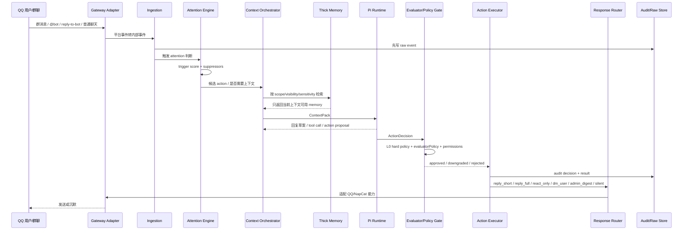
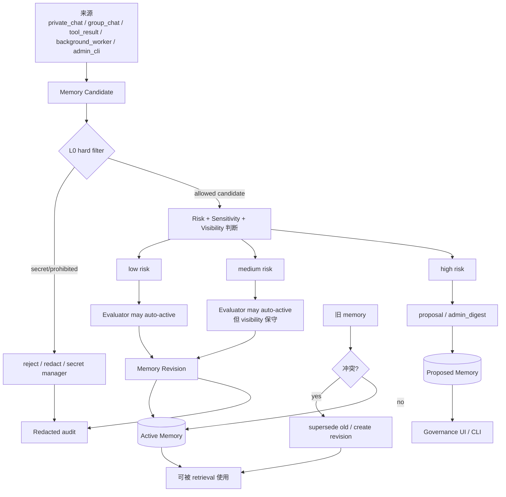
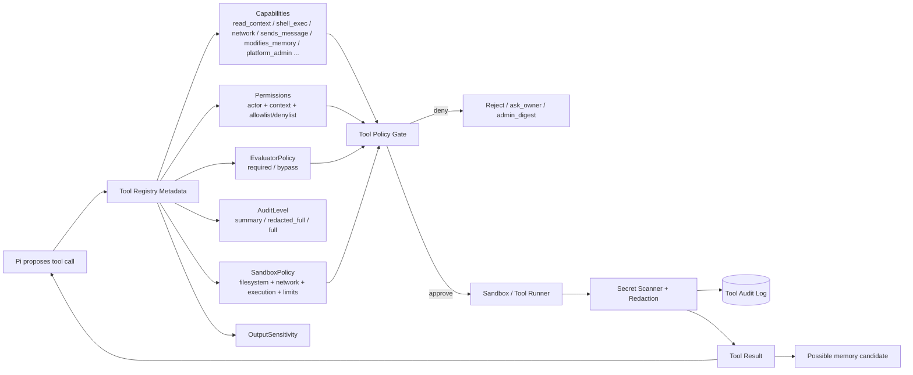

# LetheBot Architecture Flow Overview

这份文档把当前 D1-D8 讨论后的架构设计画成流程图，并说明它如何工作、为什么具备处理复杂情况的能力。

注意：这里描述的是当前正式设计，不等于所有能力已经在代码中实现。它的价值是给后续实现提供边界、流程和复杂情况处理策略。

## 1. 总体流程图

```mermaid
flowchart TD
  %% External platform
  QQ[QQ 用户 / 群聊 / 私聊] --> NC[NapCat / OneBot]
  NC --> GW[Gateway Adapter\n协议适配 / 收发消息 / 能力探测]

  %% Ingestion
  GW --> ING[Ingestion / Event Bus\n标准化事件]
  ING --> RAW[(Raw Event Store\n原始事件 / 审计基础)]
  ING --> ID[Identity Registry\ncanonical_user_id / platform_accounts / group_memberships]
  ING --> ATT[Attention Engine\ntrigger score + suppressors]

  %% Memory/background
  RAW --> BW[Background Workers\n总结 / 抽取 / 反思 / decay / embeddings]
  BW --> MC[Memory Candidates\n候选记忆 / 摘要 / digest]
  MC --> MEMGATE[Memory Policy Gate\nL0 hard filter + evaluator]
  MEMGATE --> MEM[(Thick Memory Layer\nmemory_records / sources / revisions / embeddings)]
  MEM --> GOV[Governance UI / CLI\n查看 / 删除 / disable / rollback / why]
  RAW --> GOV

  %% Context
  ID --> CTX[Context Orchestrator\n检索 / 排序 / token budget / prompt assembly]
  ATT --> CTX
  MEM --> CTX
  RAW --> CTX
  CTX --> CP[ContextPack\nrecent messages + visible memory + participant metadata]

  %% Reasoning
  CP --> PI[Pi Agent Runtime\n推理 / 回复草案 / 工具调用草案 / action proposal]
  PI --> AD[ActionDecision\nactions[] / riskLevel / confidence / reasons / suppressors]

  %% Tools
  PI --> TO[Tool Orchestrator]
  TO --> TR[Tool Registry\ncapabilities / permissions / evaluatorPolicy / auditLevel / sandboxPolicy]
  TR --> TPG[Tool Policy Gate]
  TPG --> SB[Sandbox / Persistent Tools\nfilesystem / network / shell / long-running]
  SB --> TRES[Tool Result\nredacted / summarized / audited]
  TRES --> PI
  TRES --> RAW
  TRES --> MC

  %% Evaluation and execution
  AD --> EVAL[Evaluator / Policy Gate\nLLM evaluator if required + deterministic L0 policy]
  ATT --> EVAL
  TO --> EVAL
  EVAL -->|approved / downgraded / rejected| EXEC[Action Executor\ncooldown budget / capability fallback / audit / rollback handle]
  EVAL -->|proposal / high risk| GOV
  EXEC --> AUDIT[(Audit Log\ndecision id / actor / reason / result / redaction)]
  EXEC --> MEM

  %% Delivery
  EXEC --> RR[Response Router\n群消息 / 私聊 / reaction / folded forward / admin digest]
  RR --> GW
  GW --> NC
  NC --> QQ

  %% Styling
  classDef platform fill:#1f2937,stroke:#94a3b8,color:#e5e7eb
  classDef gateway fill:#083344,stroke:#22d3ee,color:#e0f2fe
  classDef event fill:#7c2d12,stroke:#fb923c,color:#fff7ed
  classDef memory fill:#4c1d95,stroke:#a78bfa,color:#f5f3ff
  classDef reasoning fill:#064e3b,stroke:#34d399,color:#ecfdf5
  classDef policy fill:#881337,stroke:#fb7185,color:#fff1f2
  classDef tool fill:#78350f,stroke:#fbbf24,color:#fffbeb
  classDef storage fill:#312e81,stroke:#818cf8,color:#eef2ff

  class QQ,NC platform
  class GW,RR gateway
  class ING,ATT,BW,MC event
  class MEM,MEMGATE,GOV memory
  class CTX,CP,PI,AD reasoning
  class EVAL,EXEC,TPG,AUDIT policy
  class TO,TR,SB,TRES tool
  class RAW,ID storage
```

## 2. 一条普通群消息如何工作



关键点：

- 消息先进入 raw event store，避免后续无法解释。
- Attention 不输出“必须回复”，只输出候选 action 和 suppressor。
- Context Orchestrator 只注入当前允许看的记忆和身份信息。
- Pi 负责推理，但不直接拥有危险执行权。
- Evaluator / Policy Gate 决定是否批准、降级、拒绝或转 admin digest。
- Action Executor 负责真实执行、cooldown、fallback、audit、rollback handle。

## 3. 记忆写入如何工作



复杂边界：

- 群聊内容不能单次普通发言就变成 user memory。
- 第三方评价不能自动变成被评价者画像。
- medium risk 可以自动 active，但 visibility 必须保守。
- high risk 默认 proposal/admin digest。
- secret/prohibited 不进入普通 memory。
- 所有 auto-active 都要 source、revision、rollback/supersede、why trace。

## 4. 工具调用如何工作



关键点：

- tool metadata 不是 feature enable 开关。
- `evaluatorPolicy=bypass` 只是不走 LLM evaluator；不绕过 permissions / sandbox / audit / L0。
- 高风险 capability，例如 `shell_exec`、`credential_access`、`platform_admin`，默认 required。
- 工具输出可能是 `secret_possible`，必须先扫描和 redaction，再进入 audit、prompt 或 memory candidate。

## 5. 为什么它有面对复杂情况的能力

当前架构不是“LLM 直接看到群消息然后回复”的单线系统，而是多层可降级、可审计、可回滚的系统。

### 5.1 多种 action，而不是 reply/ignore

系统可以选择：

- `silent_store`
- `silent_summarize_later`
- `reply_short`
- `reply_full`
- `reply_with_tool`
- `propose_memory`
- `admin_digest`
- `schedule_background_task`
- `dm_user`
- `react_only`
- `send_folded_forward`

所以复杂群聊里不必二选一：不是“机械回复”或“完全忽略”，而是可以短答、沉默、转 digest、后台总结、私聊、reaction、折叠长回复。

### 5.2 trigger + suppressor 能处理社交复杂性

`@bot`、reply-to-bot、命令前缀、owner/admin 指令只是高权重 trigger，不是强制回复。

Suppressor 可以因为这些原因降级：

- 群里正在吵架；
- 多个真人已经在回答；
- bot 刚刚说过话；
- 玩梗线程不适合解释；
- 回复会泄漏 private memory；
- 需要高风险 memory；
- cooldown 命中；
- 长回复无法折叠。

这让 bot 更像“能判断场合的人”，而不是关键词机器人。

### 5.3 记忆有 scope / visibility / sensitivity

复杂记忆问题被拆成不同维度：

- `scope`: 属于谁；
- `visibility`: 哪里能用；
- `sensitivity`: 内容风险；
- `source_context`: 来源；
- `authority`: 谁能改；
- lifecycle: proposed / active / disabled / superseded / deleted。

这能处理：

- 私聊记忆不该在群里说；
- 群聊观察不一定是用户真实偏好；
- 第三方评价不能变成被评价者画像；
- 删除/disable 后必须立即不再 retrieval；
- 新旧偏好冲突时 supersede 而不是静默覆盖。

### 5.4 evaluator 和 deterministic policy 分工

LLM/evaluator 负责判断模糊场景，但硬边界由 deterministic policy 和 executor 执行。

这能避免：

- Pi 自己批准自己的高风险工具；
- prompt 里说“不要泄漏”但工具仍然执行；
- memory 写入没有审计；
- bypass evaluator 被误解为 bypass 所有安全层。

### 5.5 Gateway capability gate 处理平台差异

NapCat/OneBot 能力不是 reasoning 层假设。

例如：

- true reaction 可用 -> `emoji_like`；
- true reaction 不可用 -> face message；
- face message 也不适合 -> silent；
- folded forward 可用 -> 合并转发；
- 不可用 -> 短摘要 / DM / admin digest / silent。

这能避免设计绑定某个 QQ 协议实现。

### 5.6 audit / revision / governance 让错误可恢复

复杂系统一定会误判，所以架构提供：

- audit log；
- evaluator decision id；
- memory revisions；
- supersede；
- rollback；
- `/why` 或 owner/admin trace；
- user deletion / opt-out / unlink。

这表示系统不要求一次判断永远正确，而是允许事后治理。

## 6. 复杂场景示例

| 场景 | 架构如何处理 |
|---|---|
| 群里 @bot，但正在争吵 | trigger 加分，但 conflict suppressor 降级为 silent/admin_digest/短降温 |
| 用户说“记住我喜欢短回答” | explicit remember -> memory candidate -> low/medium risk -> evaluator auto-active 或保守 visibility |
| 群友说“A 最近肯定抑郁” | 第三方评价，不进入 A 的 user memory；最多 redacted group summary/admin digest |
| 私聊记忆可能影响群回答 | Context Orchestrator 检查 visibility；private_only 不公开引用 |
| 工具要读本地文件并发群 | Tool Registry 标记 read_local + sends_message；permissions/evaluator/audit/sandbox 同时生效 |
| shell_exec 在 Docker 里跑 | Docker 只是 execution backend；仍有 filesystem/network/runtime/output/audit policy |
| 生成了很长回答 | 优先 folded forward；不可用则摘要/DM/admin digest，避免刷屏 |
| 主动 DM 用户 | dm_user 是特殊 action；需要 evaluator/cooldown/audit/opt-out，不是普通 send_message 参数 |
| 用户删除记忆 | state=deleted/disabled，retrieval 立即排除；保留必要 tombstone/audit |
| QQ ID 需要用于确认身份 | 作为 operational identity data 按需结构化注入，不当作普通 memory，也不当作 secret |

## 7. 当前设计能力评估

结论：设计上具备面对复杂情况的能力。

原因：

1. 它不是单一 chat handler，而是 Gateway / Ingestion / Identity / Attention / Context / Pi / Evaluator / Executor / Memory / Tool / Governance 的分层系统。
2. 它允许 action 降级和 fallback，不依赖一次性“回复/不回复”。
3. 它把模糊判断交给 evaluator，把硬边界交给 deterministic policy。
4. 它让记忆和身份都有生命周期、来源、权限和可删除性。
5. 它承认平台能力差异，通过 Gateway capability profile 适配。
6. 它假设系统会犯错，所以设计了 audit、revision、rollback、supersede 和治理入口。

限制：

- 能力目前主要是架构设计能力，具体强度取决于后续实现是否严格保持这些边界。
- 如果实现时把 Pi、policy、tool execution、memory write 混在一起，复杂情况处理能力会明显下降。
- P0 可以先实现最小字段和最关键 gates，但不要破坏这些层之间的所有权边界。
