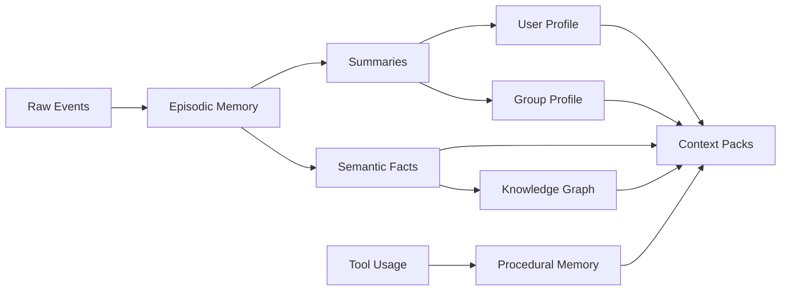
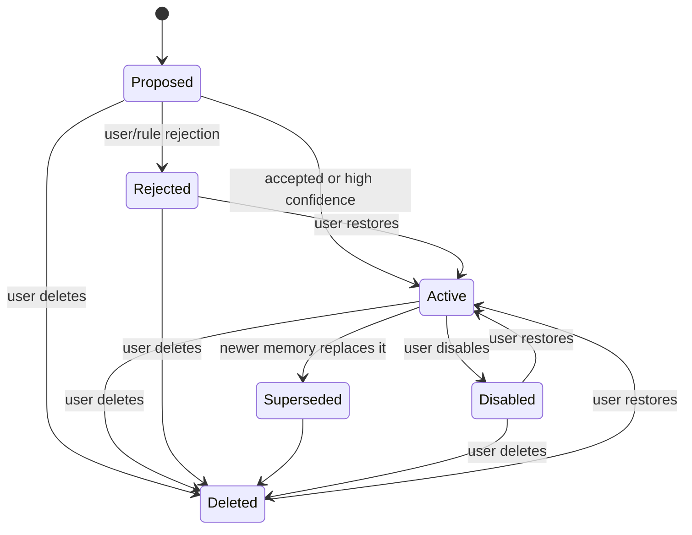

# Memory System

LetheBot memory is intentionally thicker than a vector store. Vector search is one retrieval mechanism, not the source of truth.

## Memory Types



### Raw Event Log

The current `raw_events` log stores normalized gateway chat events and local
`bot.response` agent events. Tool calls and turn evidence live in their
dedicated repositories/audit rows rather than additional raw-event types. Raw
events can have retention policies, but they should not be silently rewritten.

### Episodic Memory

Time-bound events:

- A user asked for help on a project.
- A group discussed a topic.
- A decision was made.
- The bot made a mistake and was corrected.

### Semantic Memory

Stable facts:

- User preferences.
- Known projects.
- Confirmed preferred names.
- Constraints.
- Long-term interests.

Nickname and group-card history are display metadata, not ordinary semantic memory. A preferred name can become user memory only when there is explicit evidence, such as a user correction or a group card that clearly says "please call me X".

### Group Memory

Group-level facts:

- Group rules.
- Common topics.
- Recurring members.
- Inside jokes.
- Recent rolling summaries.

### Procedural Memory

Reusable process knowledge:

- How a user prefers files to be summarized.
- Which tools work well for a recurring task.
- Common troubleshooting procedures.

## Memory Lifecycle



## Required Metadata

Current durable rows require stable record, boundary, content, lifecycle,
confidence/importance, and timestamp fields. Governed new writes also require at
least one typed source/evidence link. Scope-specific owner columns,
`subject_user_id`, `source_context`, expiry, and evaluator identity are nullable
because they apply only to some records or legacy rows; repository/writer policy
must supply and validate them when the selected scope or route requires them.

Current record fields include:

- Stable ID.
- Scope: global, user, group, conversation, tool, or system.
- Visibility.
- Sensitivity.
- Scope-specific owner identifiers when applicable.
- Subject user identifiers when the record describes people.
- Typed source/evidence links on governed new writes.
- Optional source context.
- Epistemic authority/provenance.
- Created and updated timestamps.
- Confidence.
- Importance.
- Lifecycle state.
- Policy/evaluator decision ID when the route supplies one.

Retrieval tags and embedding references remain future extensions; they are not
current `memory_records` fields.

## Boundary Fields

Memory records use separate fields for separate policy questions:

- `scope`: who or what the memory belongs to.
- `visibility`: where it may be used or injected.
- `sensitivity`: how risky the content is.
- `authority`: epistemic provenance (`user_stated`, `inferred`,
  `tool_derived`, or `system`), not mutation authorization. Actor class,
  ownership, scope, visibility, and lifecycle policy authorize mutations.
- `source_context`: where the evidence came from.

### Scope

Schema should support:

- `user`
- `group`
- `conversation`
- `system`
- `tool`
- `global`

MVP usage should focus on `user`, `group`, `conversation`, and `system`. `tool` and `global` are reserved but should be used sparingly.

### Visibility

P0 visibility values:

- `private_only`
- `same_user_any_context`
- `same_group_only`
- `owner_admin_only`
- `public`

Visibility controls use/injection boundaries. It is not the same as sensitivity and not the same as scope.

### Sensitivity

P0 sensitivity values:

- `normal`
- `personal`
- `sensitive`
- `secret`
- `prohibited`

`secret` is distinct from `prohibited`. Secret material may need a credential manager, but it must not become ordinary durable memory content. Prohibited material should not be retained as memory content at all.

### Source Context

P0 source contexts:

- `private_chat`
- `group_chat`
- `admin_cli`
- `tool_result`
- `background_worker`
- `imported_document`

Background workers must preserve links to original source events. A worker is often the extractor, not the true source.

`source_context` describes the policy context; it is not durable source
identity. New writes must supply explicit `sources[]`. Internal source types
resolve transactionally to canonical rows: `raw_event` to `raw_events.id`,
`chat_message` to `chat_messages.id`, `tool_output` to a successful
`tool_calls.id`, and `worker_extraction` to exactly one completed extraction
`jobs.id` or `job_attempts.id`. A worker source is usable only alongside a
separate canonical raw/chat source for the same memory, and the completed job
evidence must reference that same source. `imported_document` remains a source
context only; it does not create an opaque source class.

`user_command` is the only opaque source type. It is accepted only when the
source explicitly sets `external=true` and both actor and source context are
`admin_cli`. Other source types reject `external=true`. Historical rows that
cannot be resolved safely remain `legacy_unresolved`; new governed writes never
use that state.

Automatic fact extraction is a durable, reference-only effect. A deterministic
candidate check runs after the raw claim and admits the job in the same
transaction as the canonical chat row, so silent, suppressed, failed, or
undelivered reply paths do not lose a matching source. Private admission retains
the existing first-person patterns. Group auto-admission accepts only bounded
exact name, attribute, like, and dislike statements; generic identity, embedded
reports, questions, hypotheticals, wants, and needs do not enqueue automatic
group extraction. The job payload contains the canonical `chat_messages.id` and
canonical target user ID, while the worker reloads chat content and provenance
from SQLite and requires an inbound QQ gateway event plus a matching active
platform account. Candidate
memory IDs use the versioned `extraction-v1-<sha256>` namespace derived from the
canonical source, target user, scope, kind, and content. Retry reuses only a
match on the extraction effect's owned identity, boundary, content, and required
canonical chat source fields. It does not compare later
lifecycle/confidence/importance changes or extra source rows, and it never
mutates/restores lifecycle state during reuse; a collision in the effect-owned
fields fails closed. Create authority is read from revision 1's decision column
and snapshot plus the `memory.create` audit, not from the mutable current record.
Rejection audit effects
are inserted once per candidate, while transient candidate failures fail the
job for retry. The created memory links to the canonical chat row and records
the worker as extractor; any additional `worker_extraction` link must satisfy
the completed-job and matching-evidence rule above. Logs and job diagnostics
contain bounded codes/metadata rather than the matched fact.

## Auto-Active Policy

Agent-originated memory candidates use the governed proposal/evaluation path;
models never receive direct database write access.

```text
memory candidate
  -> L0 hard filter
  -> evaluator / risk classifier
  -> structured decision
  -> governed proposal/effect writer
  -> memory_records + memory_sources + memory_revisions + audit log
```

Default risk handling:

- low risk: evaluator may auto-active;
- medium risk: evaluator may auto-active only with conservative visibility such as `private_only`, `same_group_only`, or `owner_admin_only`;
- high risk: proposal; a separate admin-digest route is a future policy option;
- secret/prohibited: reject or redact, never active.

Private user memory cannot become automatically active from an evaluator result
whose confidence is below `0.85`. Group-derived user memory remains proposed
regardless of an evaluator recommendation.

Background summaries are a separate current writer route. `SummaryWorker`
stores source-backed active summaries through `MemoryRepository` and receives a
local `policy:l0:active:*` policy identifier when no evaluator decision is
supplied. It does not currently create an `evaluator_decisions` row or pass
through `ActionExecutor`. Treat that identifier as revision/audit policy
evidence, not durable model-evaluator authority; background memory cutover
for summaries remains separate from automatic extraction.

For an opted-in group summary, three durable records have separate roles:
typed `jobs.payload` freezes the exact ordered post-ContextBuilder source
selection before the effect; `group_summary_job_bindings` records the exact
policy generation and scope that authorize execution; and final internal
`memory_sources` provide FK-backed provenance for the created memory. Planning
uses local raw-event ingress order and a pre-budget threshold, so a message that
arrives after enqueue cannot join the window even if its platform timestamp is
older. Missing, reordered, cross-scope, pre-epoch, or budget-omitted sources fail
before Provider use, and the exact source snapshot is reread in the governed
memory transaction.

Extraction uses the configured evaluator, schema v4's job-attempt-owned
Provider invocation, the
canonical raw event as evaluator evidence, and one atomic decision plus
governed-memory transaction. A model-backed decision must link the exact
completed invocation; stub/local-policy decisions remain unlinked.
The owner must still be the exact current attempt with matching worker/lease
owner and an unexpired lease when the transaction begins and after its
synchronous effect; expiry rejects and rolls back all evaluator, memory, source,
revision, audit, and FTS writes.
If the configured evaluator invocation throws, the candidate stays rejected:
`MemoryProposalService` writes one fixed, idempotent
`memory.candidate_rejected` audit for the deterministic candidate effect and
creates no memory/source/revision/FTS rows. The catch is limited to the evaluator
call itself; missing writer, authority, or source configuration remains a caller
error, and Provider diagnostics are not copied into the audit.

No auto-active memory is allowed without usable source metadata. Every create
request must provide non-empty `sources[]`; `source_context` never substitutes
for a source and no `memory:<memoryId>` fallback is fabricated. Source IDs must
be non-empty and unique within one create request, and source timestamps must
be finite. The governed repository resolves every source inside the create
transaction before inserting the memory record. Missing, wrong-table,
unsuccessful-tool, incomplete/unlinked worker, and invalid external evidence
rejects the whole write, leaving no memory, source, revision, audit, or FTS row.

## Group Chat to User Memory

Group chat can inform user memory, but with stricter rules:

- group-chat-to-user-memory needs explicit user intent or repeated evidence;
- a single ordinary group message must not become active user memory; a matched
  source may create only a governed proposal pending review;
- third-party evaluations must not become the evaluated user's memory;
- group conflict or relationship judgements must not become user memory;
- if a group-chat-derived user memory is active, its source context remains `group_chat`;
- visibility should not default to `public`;
- the governed repository applies an L0 final guard so direct
  `source_context=group_chat` + `scope=user` writes with unsafe ordinary
  visibility such as `private_only`, `same_user_any_context`, or `public` are
  stored as `same_group_only`, with the policy adjustment recorded in revision
  and audit evidence.

## Revisions, Rollback, and Supersede

Every active memory creation must have a revision record with:

- previous state;
- new state;
- policy/evaluator decision ID; an ID alone does not prove a linked
  `evaluator_decisions` row;
- for model-backed creation, the decision's completed source-bound
  `model_invocation_id` link;
- reason;
- source IDs;
- actor/executor;
- timestamp.

Conflicting updates should mark older memory as `superseded` or create a revision. Do not silently overwrite durable memory.

Existing records must not transition back to `proposed` through the lifecycle
update path. Proposal state is produced by governed memory creation, while later
lifecycle operations create revision/audit evidence for activation, rejection,
supersede, disable, delete, or restore transitions. Repository approve/reject
operations require current `state=proposed`; non-proposed records cannot be
approved or rejected through those proposal-decision helpers.
The repository also enforces the lifecycle state machine at the durable boundary:
proposed records may be approved, rejected, or deleted; active records may be
disabled, deleted, or superseded; disabled/rejected/deleted records may only be
restored to active or deleted where applicable; and superseded records may only
be deleted. Invalid direct transitions are rejected before state, revision, or
audit mutation.

Lifecycle mutation authority is not inherited. A writer-supplied evaluator
decision is recorded exactly; otherwise the repository generates
`policy:l0:<target-state>:<memory-id>` for that mutation and writes it
consistently to the current record, revision, and audit. The previous snapshot
and revision 1 retain the earlier/create identity, so an evaluator `propose`
decision cannot appear to authorize a later admin approval, disable, restore,
supersede, or delete.

Disabled, deleted, and superseded records must be excluded from ordinary retrieval immediately.
Expired active records must also be excluded from ordinary repository retrieval
and search; expiration is a lifecycle boundary, not just a prompt-layer filter.
Repository-backed memory creation rejects non-finite `expires_at` lifecycle
metadata before durable rows are written, so invalid expiration cannot silently
become permanent or unreliable memory.

## QQ And CLI Memory Governance

The implemented QQ surface is deliberately small and exact:

```text
/memory
/memory forget <memory-id>
/memory summary status
/memory summary enable
/memory summary disable
/why
```

Parsing is case-sensitive and limited to 512 input characters. Memory IDs match
`[A-Za-z0-9][A-Za-z0-9._:-]{0,127}`; malformed families remain recognized and
receive usage only after authority succeeds. `/memoryx`, `/whyever`, generic `!`
commands, and narrative management text remain ordinary chat. Recognized
unauthorized commands receive the same deterministic denial for valid and
invalid syntax rather than entering Pi.

The optional `LETHEBOT_BOT_OWNER_QQ_ID` identifies the bot owner. Otherwise QQ
authority comes only from the persisted normalized `owner`/`admin` role in the
exact current group. Before applying that authority, `GovernanceService` rereads
and reconciles the canonical raw event, derived chat row, normalized stored QQ
payload, active platform account, and canonical user, and then reparses the
stored command text. A group command source is canonical only when its group ID
matches `qq-group-[1-9][0-9]{4,11}` and its conversation ID is that exact same
value. Ambiguous duplicate raw/chat derivations and malformed command scope fail
verification; non-command narrative text remains ordinary chat.

Group `/memory` listing is intentionally narrower than bot-owner authority. It
may show only non-secret, non-deleted exact-group, exact-conversation, and
same-group user records. It never shows private, global, or other-group memory,
even when the caller is the bot owner. Only a configured bot owner in private
chat receives a broad listing. Group owner/admin `forget` is restricted to that
same group-safe record set. The bot owner and local CLI may forget a known ID
broadly; failure responses do not distinguish missing, deleted, and
unauthorized records. A successful forget uses the repository's deleted-state
transition and creates traceable revision/audit evidence, so ordinary retrieval
and search exclude it immediately while retention/restoration rules still
apply.

Group summary policy is absent/disabled by default and is keyed to the exact
group. `status` is read-only. A real enable/disable transition increments the
policy generation and audits old/new state, authority, source, and canceled-job
count; requesting the current state is idempotent. Disable blocks new planning
and retained-summary retrieval immediately and atomically fails/cancels bound
pending jobs without deleting summary memory. Enable and re-enable set an
exclusive eligibility boundary later than the supplied clock, the prior policy
timestamp, every persisted exact-group chat ingress, and normalized exact-group
raw ingress still awaiting a `chat_messages` row. Disable advances beyond the
created/updated clocks of bound pending jobs when representable and saturates at
`Number.MAX_SAFE_INTEGER`, so a rolled-back or hostile future clock cannot block
cancellation. Neither path backfills sources from a disabled or pre-enable
interval.

The policy audit stores redacted display projections of group/source identifiers
and a purpose-bound SHA-256 `groupIdHash` for same-group correlation without the
raw canonical QQ group ID. Memory listing bounds and redacts identifiers/titles
and escapes OneBot `[CQ:...]` title text. Delete display/audit bodies use a
bounded memory-ID projection; the exact local audit `event_id` remains the
lookup key, while the L0 mutation decision contains a purpose-bound SHA-256
digest rather than the raw memory ID.

`/why` is also served by this boundary, but it does not expose memory content.
It selects the latest prior QQ turn by canonical raw-event ingress order in the
exact conversation and returns only bounded/redacted status and evidence counts.
All recognized QQ governance families create a zero-token local turn and one
Attention-decided reply action before ordinary Attention; Pi, evaluators, and
tools are not called. `ActionExecutor` owns delivery, and canonical ingress
deduplication prevents duplicate command effects. The governance mutation/audit
and reply action decision are one immediate transaction; decision-persistence
failure rolls all three back before delivery and leaves failed turn/admission
evidence. A handled send failure keeps
the local turn completed with durable failed execution and no `bot.response`;
thrown governance or persistence failures follow the ordinary failed-turn and
failed-admission contract.

CLI `delete-memory` and
`memory-summary <status|enable|disable> --group <groupId>` invoke the same
service as actor `local_admin` in `admin_cli` context. The summary command accepts
only canonical `qq-group-[1-9][0-9]{4,11}` scope. They share the QQ mutation
transactions and emit bounded/redacted output rather than raw policy or memory
objects.

## Identity and Display Data

Platform account IDs, current nicknames, group cards, avatar hashes, and nickname history are not ordinary memory by default. They belong to the identity/display model in `identity-model.md`.

Only stable, confirmed user preferences derived from display data, such as a preferred name, should become memory candidates.

## Outbound Memory-Claim Evidence

Memory wording is evidence-bound independently of retrieval and memory writes.
A durable claim requires the exact proposition from a currently active memory
selected in the same turn's ContextTrace. At decision time the record is
rechecked for subject, scope, visibility, sensitivity, lifecycle, expiry, and a
usable source; selection alone is not authority.

A same-turn proposal claim requires the fully committed `memory.propose` chain:
the approving evaluator decision, successful tool result, proposed memory,
matching source set, create revision, and memory/tool audits must agree on turn,
actor, context, content, scope, visibility, kind, and chronology. It authorizes
pending-review wording only. A requested, denied, failed, partial, or merely
planned effect authorizes no claim.

Propositions match after bounded presentation normalization, not semantic or
paraphrase matching. Multiple matching records are ambiguous and fail closed.
Unsupported claims are made neutral before action persistence; unsafe
secret-shaped or platform-identifier-shaped propositions are not echoed. The
claim guard is read-only and never activates, proposes, disables, or otherwise
changes memory lifecycle state.

## Retrieval Policy

Retrieval should combine:

- Explicit scope filters.
- Recency.
- Importance.
- Semantic similarity.
- Keyword search.
- User or group affinity.
- Current interaction mode.

Context injection should record which memory IDs were used for each agent turn.

Repository retrieval and full-text search apply lifecycle, sensitivity, and
context visibility filters before `LIMIT` or FTS rank limiting. Inaccessible
high-importance or high-rank records must not starve lower-ranked records that
are visible in the current private/group context.

ContextBuilder now uses the existing FTS5 index automatically without adding an
embedding dependency. It builds separate bounded queries for the explicit
current message, an exactly resolved same-conversation quote, and recent thread
text. FTS is executed only on repository routes carrying current-context SQL
visibility and ownership/scope predicates, then merged with the scoped
importance/recency fallback. Equal FTS ranks use memory ID order before the
bounded result is selected.
Profiles retain their explicit priority; remaining records rank by query source,
scope affinity, in-memory FTS ordinal, importance, recency, confidence, and
stable ID, and token budgeting preserves that order. Query text and terms are
not durable trace data.

For every selected record, ContextTrace may store a content-free selection item
containing fixed query-source and retrieval-method enums, exact scope affinity,
a positive 1-based retrieval rank, and the selection reason. These items are
stored as optional metadata on the existing selected-memory objects in
`context_traces.memories`; no schema migration or prompt/tool memory field is
introduced. Existing selected/rejected ID evidence remains authoritative for
candidate accounting.

Group-summary opt-in is a separate L0 retrieval condition, not a visibility
alias. In a group context, every retained group-scoped summary requires an
enabled policy for the exact current group in the same SQL statement that reads
memory. Missing/disabled policy and missing exact group context fail closed.
Disabling policy does not mutate or delete the retained memory, so unscoped
governance lookup and `findById()` can still inspect, delete, or later restore it.
The built-in `memory.search` path inherits this gate; the ephemeral
`group.recent_summary` raw-chat tool does not read retained summary memory and is
not controlled by this opt-in.

The built-in `memory.search` tool is an audited read-only retrieval surface, not
a durable memory writer. It uses repository retrieval/search filters so ordinary
tool results inherit lifecycle, sensitivity, visibility, actor, group, and
expiration exclusions. A tool result may include memory content and coarse
metadata for visible records, but it intentionally omits durable memory IDs and
source event IDs; source context is reduced to a known coarse category such as
`private_chat`, `group_chat`, `system`, or `unknown` before the result reaches
Pi/audit/tool-call output.

The built-in `memory.propose` tool is a proposal writer, not an auto-active
memory path. Its registry metadata requires evaluator review. PiAdapter passes
the approved turn's source event IDs and evaluator decision ID through trusted
handler context, so tool input cannot choose provenance or authority. The
handler requires an approving decision for the same tool, turn, actor,
invocation context, and source set; prepares rather than immediately writes the
mutation; preserves the trigger's timestamp as an internal `raw_event` source
with `extracted_by=tool`; and returns no memory/source/evaluator IDs. PiAdapter's
same-database coordinator revalidates the approval and calls
`MemoryRepository.createSync()` in the same transaction as the success tool call
and tool audit, so the record/source/revision/memory-audit/FTS effect cannot
survive terminal persistence failure. Matching evaluator identity is recorded
across the entire successful chain.
User-scoped proposals reject an effective `memory_association=opted_out`
preference before source-row lookup and revalidate it inside the coordinated
commit before any memory/source/revision/memory-audit effect. A user's
association preference does not block group- or global-scoped proposals.
Secret/prohibited content is rejected by repository policy. Ordinary
group-chat user visibility is forced to `same_group_only`, while an explicit
`owner_admin_only` proposal remains owner/admin-only; global proposals require
owner/admin actor class.

The built-in `memory.disable` tool is a lifecycle writer with the same evaluator
requirement. After a source-bound unchanged approval and repeated L0 check, it
prepares `MemoryRepository.disableSync()` for the same transaction as the success
tool call and tool audit. A committed success excludes the record from ordinary
retrieval immediately while preserving source/revision/audit evidence linked to
the evaluator decision; a failed terminal write rolls the state/revision/audit
change back. The handler targets only active memory allowed by local ownership
rules, refuses proposed/rejected/superseded/deleted records, and returns no
durable IDs.
