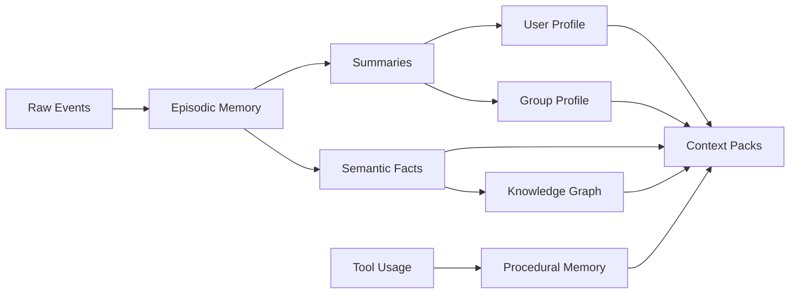
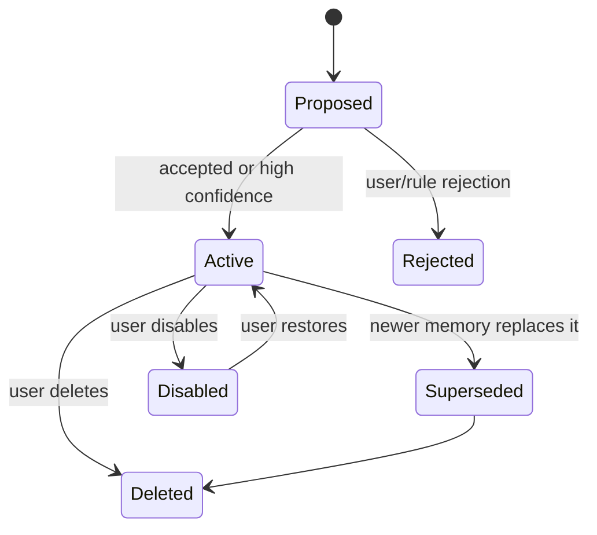

# Memory System

LetheBot memory is intentionally thicker than a vector store. Vector search is one retrieval mechanism, not the source of truth.

## Memory Types



### Raw Event Log

Immutable audit trail of platform events, agent events, and tool events. Raw events can have retention policies, but they should not be silently rewritten.

### Episodic Memory

Time-bound events:

- A user asked for help on a project.
- A group discussed a topic.
- A decision was made.
- The bot made a mistake and was corrected.

### Semantic Memory

Stable facts:

- User preferences.
- Known projects.
- Confirmed preferred names.
- Constraints.
- Long-term interests.

Nickname and group-card history are display metadata, not ordinary semantic memory. A preferred name can become user memory only when there is explicit evidence, such as a user correction or a group card that clearly says "please call me X".

### Group Memory

Group-level facts:

- Group rules.
- Common topics.
- Recurring members.
- Inside jokes.
- Recent rolling summaries.

### Procedural Memory

Reusable process knowledge:

- How a user prefers files to be summarized.
- Which tools work well for a recurring task.
- Common troubleshooting procedures.

## Memory Lifecycle



## Required Metadata

Every durable memory record should include:

- Stable ID.
- Scope: global, user, group, conversation, tool, or system.
- Visibility.
- Sensitivity.
- Owner identifiers.
- Subject user identifiers when the record describes people.
- Source event IDs.
- Source context.
- Authority / governance roles.
- Created and updated timestamps.
- Confidence.
- Importance.
- Lifecycle state.
- Evaluator decision ID when created or modified by agent-mediated policy.
- Retrieval tags.
- Optional embedding reference.

## Boundary Fields

Memory records use separate fields for separate policy questions:

- `scope`: who or what the memory belongs to.
- `visibility`: where it may be used or injected.
- `sensitivity`: how risky the content is.
- `authority`: who may edit, delete, approve, or cross-scope it.
- `source_context`: where the evidence came from.

### Scope

Schema should support:

- `user`
- `group`
- `conversation`
- `system`
- `tool`
- `global`

MVP usage should focus on `user`, `group`, `conversation`, and `system`. `tool` and `global` are reserved but should be used sparingly.

### Visibility

P0 visibility values:

- `private_only`
- `same_user_any_context`
- `same_group_only`
- `owner_admin_only`
- `public`

Visibility controls use/injection boundaries. It is not the same as sensitivity and not the same as scope.

### Sensitivity

P0 sensitivity values:

- `normal`
- `personal`
- `sensitive`
- `secret`
- `prohibited`

`secret` is distinct from `prohibited`. Secret material may need a credential manager, but it must not become ordinary durable memory content. Prohibited material should not be retained as memory content at all.

### Source Context

P0 source contexts:

- `private_chat`
- `group_chat`
- `admin_cli`
- `tool_result`
- `background_worker`
- `imported_document`

Background workers must preserve links to original source events. A worker is often the extractor, not the true source.

## Auto-Active Policy

LetheBot uses agent-mediated auto-active memory, not direct LLM writes to the database.

```text
memory candidate
  -> L0 hard filter
  -> evaluator / risk classifier
  -> structured decision
  -> policy/action executor
  -> memory_records + memory_sources + memory_revisions + audit log
```

Default risk handling:

- low risk: evaluator may auto-active;
- medium risk: evaluator may auto-active only with conservative visibility such as `private_only`, `same_group_only`, or `owner_admin_only`;
- high risk: proposal or admin digest;
- secret/prohibited: reject or redact, never active.

No auto-active memory is allowed without source metadata.

## Group Chat to User Memory

Group chat can inform user memory, but with stricter rules:

- group-chat-to-user-memory needs explicit user intent or repeated evidence;
- a single ordinary group message must not become user memory;
- third-party evaluations must not become the evaluated user's memory;
- group conflict or relationship judgements must not become user memory;
- if a group-chat-derived user memory is active, its source context remains `group_chat`;
- visibility should not default to `public`.

## Revisions, Rollback, and Supersede

Every auto-active memory must have a revision record with:

- previous state;
- new state;
- evaluator decision ID;
- reason;
- source IDs;
- actor/executor;
- timestamp.

Conflicting updates should mark older memory as `superseded` or create a revision. Do not silently overwrite durable memory.

Disabled, deleted, and superseded records must be excluded from ordinary retrieval immediately.

## Identity and Display Data

Platform account IDs, current nicknames, group cards, avatar hashes, and nickname history are not ordinary memory by default. They belong to the identity/display model in `identity-model.md`.

Only stable, confirmed user preferences derived from display data, such as a preferred name, should become memory candidates.

## Retrieval Policy

Retrieval should combine:

- Explicit scope filters.
- Recency.
- Importance.
- Semantic similarity.
- Keyword search.
- User or group affinity.
- Current interaction mode.

Context injection should record which memory IDs were used for each agent turn.

