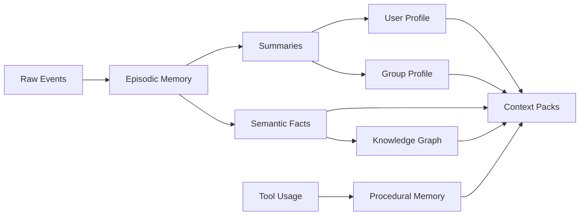
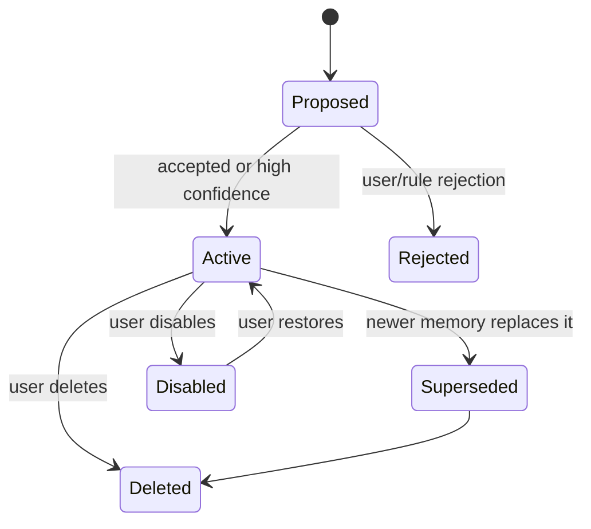

# Memory System

LetheBot memory is intentionally thicker than a vector store. Vector search is one retrieval mechanism, not the source of truth.

## Memory Types

### Raw Event Log

Immutable audit trail of platform events, agent events, and tool events. Raw events can have retention policies, but they should not be silently rewritten.

### Episodic Memory

Time-bound events:

- A user asked for help on a project.
- A group discussed a topic.
- A decision was made.
- The bot made a mistake and was corrected.

### Semantic Memory

Stable facts:

- User preferences.
- Known projects.
- Nicknames.
- Constraints.
- Long-term interests.

### Group Memory

Group-level facts:

- Group rules.
- Common topics.
- Recurring members.
- Inside jokes.
- Recent rolling summaries.

### Procedural Memory

Reusable process knowledge:

- How a user prefers files to be summarized.
- Which tools work well for a recurring task.
- Common troubleshooting procedures.

## Memory Lifecycle

## Required Metadata

Every durable memory record should include:

- Stable ID.
- Scope: global, user, group, conversation, tool, or system.
- Owner identifiers.
- Source event IDs.
- Created and updated timestamps.
- Confidence.
- Importance.
- Lifecycle state.
- Retrieval tags.
- Optional embedding reference.

## Retrieval Policy

Retrieval should combine:

- Explicit scope filters.
- Recency.
- Importance.
- Semantic similarity.
- Keyword search.
- User or group affinity.
- Current interaction mode.

Context injection should record which memory IDs were used for each agent turn.

